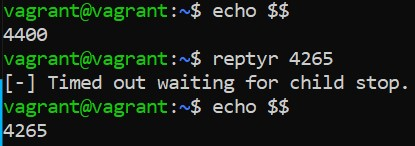

## Домашнее задание к занятию "3.2. Работа в терминале, лекция 2"

1. Команда cd имеет тип shell builtin. Она является встроенной командой Bash и меняет текущую директорию только для оболочки, в которой выполняется. Поэтому эта команда не может быть запущена как отдельная служба или программа, при остановке которой нельзя будет изменить дерикторию.
2. grep -c <some_string> <some_file>
3. Процесс systemd
4. ls ./test/ 2> /dev/pts/1
5. cat < text > file
6. Получится. Например, командой ls -lah > /dev/ttyN
7. Если выполнить команду bash 5>&1, то мы откроем новый bash процесс, где будет создан новый файловый дескриптор 5 и перенаправлен на 1, который есть STDOUT. При вызове команды echo netology > /proc/$$/fd/5, слово netology будет выведено в терминал.
8. ls -lah %  2>&1 | grep file
9. С помощью cat /proc/$$/environ мы можем увидеть переменные окружения нашего текущего процесса. Аналогичную информацию можно получить с помощью команд env и set
10. /proc/<PID>/cmdline - содержит параметры командной строки, переданные на этапе запуска процесса
/proc/<PID>/exe - является символьной ссылкой на исполненный бинарный файл
11. SSE
12. ssh -t localhost tty
13.  
    
14. sudo tee будет работать, т.к. в случае с использованием pipe будут запущено 2 процесса и вывод одного перенаправится на вход другого.
