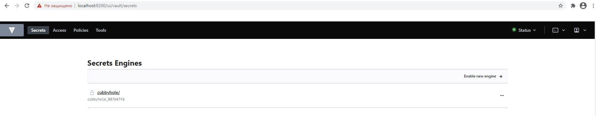
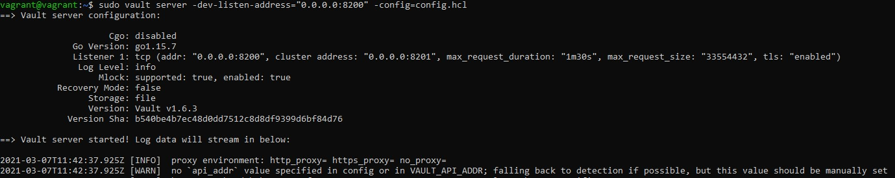
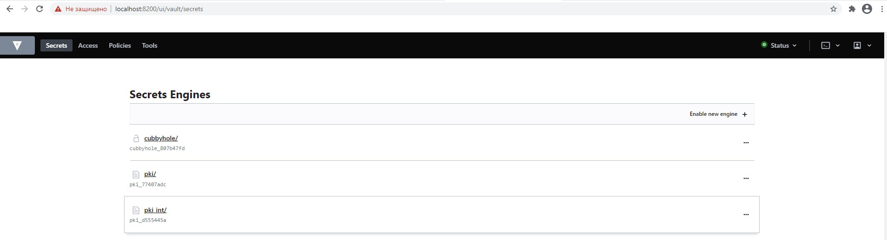
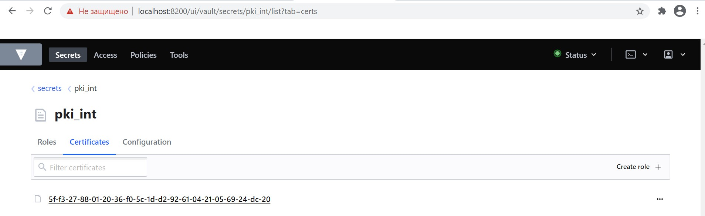
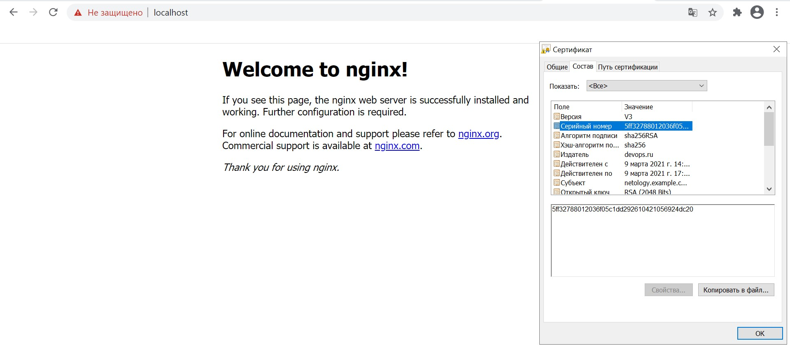
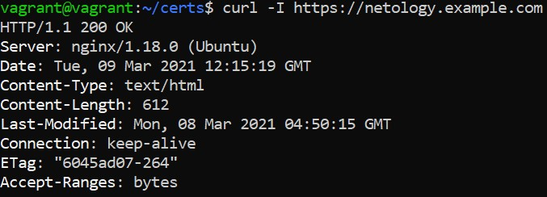

## Домашнее задание к занятию "3.9. Элементы безопасности информационных систем"

1. 
```
	curl -fsSL https://apt.releases.hashicorp.com/gpg | sudo apt-key add -
	sudo apt-add-repository "deb [arch=amd64] https://apt.releases.hashicorp.com $(lsb_release -cs) main"
	sudo apt-get update && sudo apt-get install vault
	mkdir -p vault/data
	vagrant@vagrant:~$ nano config.hcl
	ui = true

	storage "file" {
	path = "./vault/data"
	}

	# HTTPS listener
	listener "tcp" {
	address       = "0.0.0.0:8200"
		tls_cert_file = "/opt/vault/tls/tls.crt"
		tls_key_file  = "/opt/vault/tls/tls.key"
	}
```
2. sudo vault server -dev-listen-address="0.0.0.0:8200" -config=config.hcl  
	<!---->
	<!---->
3. 	<!---->
4. 	<!---->
5. 	<!---->
6. 
```
echo 127.0.0.1 netology.example.com >> /etc/hosts
ln -s /home/vagrant/certs/ca.crt /usr/local/share/ca-certificates/demo_ca.crt
update-ca-certificates
```
	<!---->
 