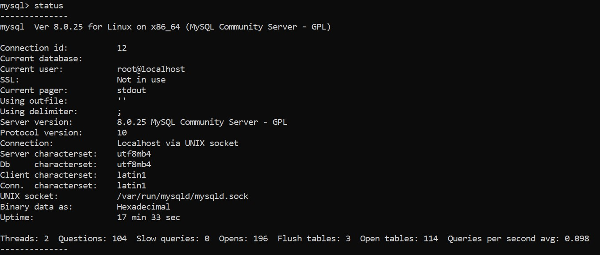
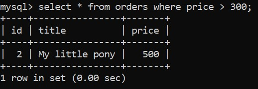
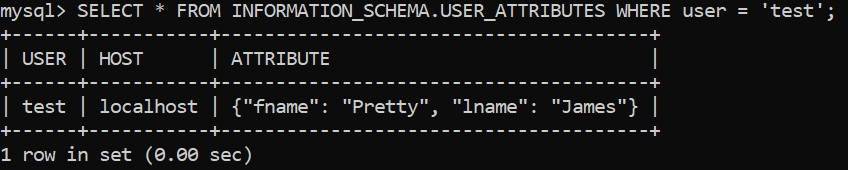
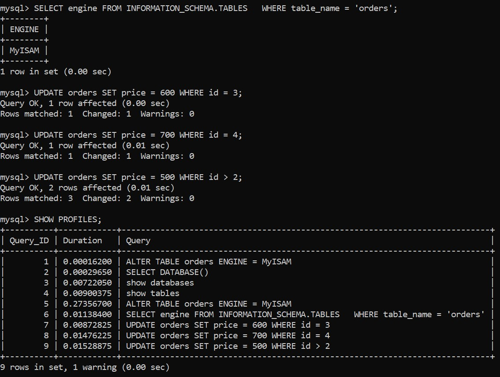
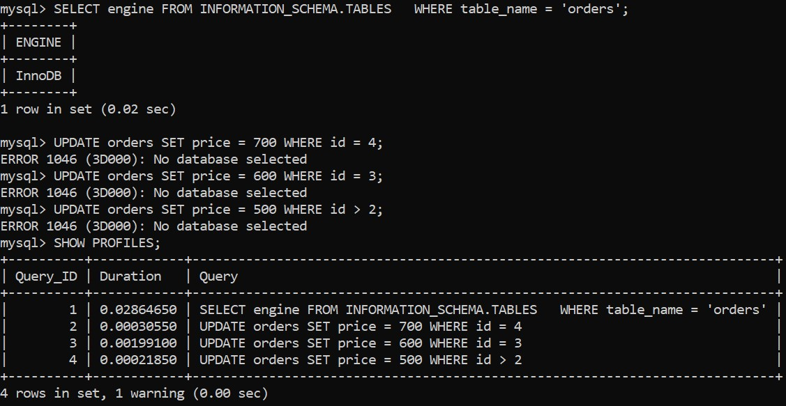
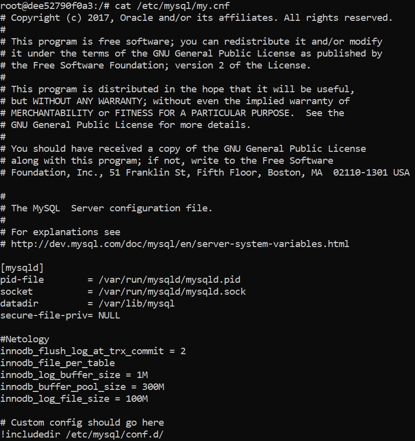

## Домашнее задание к занятию "6.3. MySQL"

1. docker run --rm --name mysql -dti -e MYSQL_ROOT_PASSWORD=root  mysql:8  

		<!---->  

Количество записей с price > 300:

		<!---->

2. 
Создание пользователя:

    CREATE USER 'test'@'localhost' IDENTIFIED WITH mysql_native_password BY 'test-pass' 
	WITH MAX_CONNECTIONS_PER_HOUR 100 PASSWORD EXPIRE INTERVAL 180 DAY FAILED_LOGIN_ATTEMPTS 3 
	ATTRIBUTE '{"fname": "Pretty", "lname": "James"}';
	
    GRANT SELECT ON test_db.* TO 'test'@'localhost';
	
Данные по пользователю test:

		<!---->

3.

Engine таблицы orders:

		<!---->

MyISAM:

		<!---->

InnoDB:

		<!---->

4.

Файл my.cnf:

		<!---->
