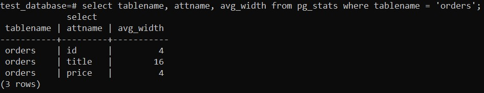

## Домашнее задание к занятию "6.4. PostgreSQL"

1. 
```
version: '2.4'
volumes:
  psql13:
services:
  postgre13:
    image: postgres:13
    volumes:
      - /root/postgre/backup/:/backup/
      - psql13:/var/lib/postgresql/data
    environment:
      - POSTGRES_PASSWORD=admin
```

- вывода списка БД - **\l**
- подключения к БД - **\c dbname**
- вывода списка таблиц - **\d**
- вывода описания содержимого таблиц - **\d table_name**
- выхода из psql - **\q**

2. Столбец таблицы orders с наибольшим средним значением размера элементов в байтах является title: avg_width = 16.

		<!---->

3. 
```
BEGIN TRANSACTION;
CREATE TABLE orders_sec (id integer NOT NULL, title varchar (80) NOT NULL, price integer DEFAULT 0) PARTITION BY RANGE (price);
CREATE TABLE orders_1 PARTITION OF orders_sec FOR VALUES FROM (500) to (999);
CREATE TABLE orders_2 PARTITION OF orders_sec FOR VALUES FROM (0) to (500);
INSERT INTO orders_sec (id, title, price) SELECT * FROM orders;
COMMIT;
```
С помощью модуля pg_pathman или pg_partman можно реализовать автоматическое создание секций. Можно и с помощью скрипта, который бы формировал создание секций автоматически.

4. **pg_dump test_database > /backup/backup_test_database.dump**
```
ALTER TABLE ONLY public.orders_1 ADD UNIQUE (title);
ALTER TABLE ONLY public.orders_2 ADD UNIQUE (title);
ALTER TABLE ONLY public.orders ADD UNIQUE (title);
```
