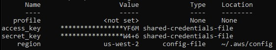

## Домашнее задание к занятию "7.1. Инфраструктура как код"

1. Вывод команды aws configure list:

		<!---->

2. При помощи инструмента Packer можно создать свой образ AMI.

- Ссылка на репозиторий с исходной конфигурацией терраформа:

**https://github.com/Owirtifo/devops-netology**

