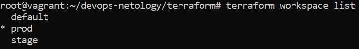

## Домашнее задание к занятию "7.3. Основы и принцип работы Терраформ"

Ссылка на репозиторий с Терраформом:

**https://github.com/Owirtifo/devops-netology**

1. Вывод команды terraform workspace list:

		<!---->

2. Вывод команды terraform plan для воркспейса prod:
```
root@vagrant:~/devops-netology/terraform# terraform plan
Acquiring state lock. This may take a few moments...

Terraform used the selected providers to generate the following execution plan. Resource actions are indicated with the following symbols:
  + create

Terraform will perform the following actions:

  # aws_instance.netology[0] will be created
  + resource "aws_instance" "netology" {
      + ami                                  = "ami-036d46416a34a611c"
      + arn                                  = (known after apply)
      + associate_public_ip_address          = (known after apply)
      + availability_zone                    = (known after apply)
      + cpu_core_count                       = (known after apply)
      + cpu_threads_per_core                 = (known after apply)
      + disable_api_termination              = (known after apply)
      + ebs_optimized                        = (known after apply)
      + get_password_data                    = false
      + host_id                              = (known after apply)
      + id                                   = (known after apply)
      + instance_initiated_shutdown_behavior = (known after apply)
      + instance_state                       = (known after apply)
      + instance_type                        = "t3.large"
      + ipv6_address_count                   = (known after apply)
      + ipv6_addresses                       = (known after apply)
      + key_name                             = (known after apply)
      + monitoring                           = (known after apply)
      + outpost_arn                          = (known after apply)
      + password_data                        = (known after apply)
      + placement_group                      = (known after apply)
      + primary_network_interface_id         = (known after apply)
      + private_dns                          = (known after apply)
      + private_ip                           = (known after apply)
      + public_dns                           = (known after apply)
      + public_ip                            = (known after apply)
      + secondary_private_ips                = (known after apply)
      + security_groups                      = (known after apply)
      + source_dest_check                    = true
      + subnet_id                            = (known after apply)
      + tags                                 = {
          + "Name" = "Netology-1"
        }
      + tags_all                             = {
          + "Name" = "Netology-1"
        }
      + tenancy                              = (known after apply)
      + user_data                            = (known after apply)
      + user_data_base64                     = (known after apply)
      + vpc_security_group_ids               = (known after apply)

      + capacity_reservation_specification {
          + capacity_reservation_preference = (known after apply)

          + capacity_reservation_target {
              + capacity_reservation_id = (known after apply)
            }
        }

      + ebs_block_device {
          + delete_on_termination = (known after apply)
          + device_name           = (known after apply)
          + encrypted             = (known after apply)
          + iops                  = (known after apply)
          + kms_key_id            = (known after apply)
          + snapshot_id           = (known after apply)
          + tags                  = (known after apply)
          + throughput            = (known after apply)
          + volume_id             = (known after apply)
          + volume_size           = (known after apply)
          + volume_type           = (known after apply)
        }

      + enclave_options {
          + enabled = (known after apply)
        }

      + ephemeral_block_device {
          + device_name  = (known after apply)
          + no_device    = (known after apply)
          + virtual_name = (known after apply)
        }

      + metadata_options {
          + http_endpoint               = (known after apply)
          + http_put_response_hop_limit = (known after apply)
          + http_tokens                 = (known after apply)
        }

      + network_interface {
          + delete_on_termination = (known after apply)
          + device_index          = (known after apply)
          + network_interface_id  = (known after apply)
        }

      + root_block_device {
          + delete_on_termination = true
          + device_name           = (known after apply)
          + encrypted             = (known after apply)
          + iops                  = (known after apply)
          + kms_key_id            = (known after apply)
          + tags                  = {
              + "Name" = "Test EBS Volume"
            }
          + throughput            = (known after apply)
          + volume_id             = (known after apply)
          + volume_size           = 8
          + volume_type           = "gp2"
        }
    }

  # aws_instance.netology[1] will be created
  + resource "aws_instance" "netology" {
      + ami                                  = "ami-036d46416a34a611c"
      + arn                                  = (known after apply)
      + associate_public_ip_address          = (known after apply)
      + availability_zone                    = (known after apply)
      + cpu_core_count                       = (known after apply)
      + cpu_threads_per_core                 = (known after apply)
      + disable_api_termination              = (known after apply)
      + ebs_optimized                        = (known after apply)
      + get_password_data                    = false
      + host_id                              = (known after apply)
      + id                                   = (known after apply)
      + instance_initiated_shutdown_behavior = (known after apply)
      + instance_state                       = (known after apply)
      + instance_type                        = "t3.large"
      + ipv6_address_count                   = (known after apply)
      + ipv6_addresses                       = (known after apply)
      + key_name                             = (known after apply)
      + monitoring                           = (known after apply)
      + outpost_arn                          = (known after apply)
      + password_data                        = (known after apply)
      + placement_group                      = (known after apply)
      + primary_network_interface_id         = (known after apply)
      + private_dns                          = (known after apply)
      + private_ip                           = (known after apply)
      + public_dns                           = (known after apply)
      + public_ip                            = (known after apply)
      + secondary_private_ips                = (known after apply)
      + security_groups                      = (known after apply)
      + source_dest_check                    = true
      + subnet_id                            = (known after apply)
      + tags                                 = {
          + "Name" = "Netology-2"
        }
      + tags_all                             = {
          + "Name" = "Netology-2"
        }
      + tenancy                              = (known after apply)
      + user_data                            = (known after apply)
      + user_data_base64                     = (known after apply)
      + vpc_security_group_ids               = (known after apply)

      + capacity_reservation_specification {
          + capacity_reservation_preference = (known after apply)

          + capacity_reservation_target {
              + capacity_reservation_id = (known after apply)
            }
        }

      + ebs_block_device {
          + delete_on_termination = (known after apply)
          + device_name           = (known after apply)
          + encrypted             = (known after apply)
          + iops                  = (known after apply)
          + kms_key_id            = (known after apply)
          + snapshot_id           = (known after apply)
          + tags                  = (known after apply)
          + throughput            = (known after apply)
          + volume_id             = (known after apply)
          + volume_size           = (known after apply)
          + volume_type           = (known after apply)
        }

      + enclave_options {
          + enabled = (known after apply)
        }

      + ephemeral_block_device {
          + device_name  = (known after apply)
          + no_device    = (known after apply)
          + virtual_name = (known after apply)
        }

      + metadata_options {
          + http_endpoint               = (known after apply)
          + http_put_response_hop_limit = (known after apply)
          + http_tokens                 = (known after apply)
        }

      + network_interface {
          + delete_on_termination = (known after apply)
          + device_index          = (known after apply)
          + network_interface_id  = (known after apply)
        }

      + root_block_device {
          + delete_on_termination = true
          + device_name           = (known after apply)
          + encrypted             = (known after apply)
          + iops                  = (known after apply)
          + kms_key_id            = (known after apply)
          + tags                  = {
              + "Name" = "Test EBS Volume"
            }
          + throughput            = (known after apply)
          + volume_id             = (known after apply)
          + volume_size           = 8
          + volume_type           = "gp2"
        }
    }

  # aws_instance.netology_for_each["10.10.1.5"] will be created
  + resource "aws_instance" "netology_for_each" {
      + ami                                  = "ami-036d46416a34a611c"
      + arn                                  = (known after apply)
      + associate_public_ip_address          = (known after apply)
      + availability_zone                    = (known after apply)
      + cpu_core_count                       = (known after apply)
      + cpu_threads_per_core                 = (known after apply)
      + disable_api_termination              = (known after apply)
      + ebs_optimized                        = (known after apply)
      + get_password_data                    = false
      + host_id                              = (known after apply)
      + id                                   = (known after apply)
      + instance_initiated_shutdown_behavior = (known after apply)
      + instance_state                       = (known after apply)
      + instance_type                        = "t3.large"
      + ipv6_address_count                   = (known after apply)
      + ipv6_addresses                       = (known after apply)
      + key_name                             = (known after apply)
      + monitoring                           = (known after apply)
      + outpost_arn                          = (known after apply)
      + password_data                        = (known after apply)
      + placement_group                      = (known after apply)
      + primary_network_interface_id         = (known after apply)
      + private_dns                          = (known after apply)
      + private_ip                           = (known after apply)
      + public_dns                           = (known after apply)
      + public_ip                            = (known after apply)
      + secondary_private_ips                = (known after apply)
      + security_groups                      = (known after apply)
      + subnet_id                            = (known after apply)
      + tags                                 = {
          + "Name" = "Netology-10.10.1.5"
        }
      + tags_all                             = {
          + "Name" = "Netology-10.10.1.5"
        }
      + tenancy                              = (known after apply)
      + user_data                            = (known after apply)
      + user_data_base64                     = (known after apply)
      + vpc_security_group_ids               = (known after apply)

      + capacity_reservation_specification {
          + capacity_reservation_preference = (known after apply)

          + capacity_reservation_target {
              + capacity_reservation_id = (known after apply)
            }
        }

      + ebs_block_device {
          + delete_on_termination = (known after apply)
          + device_name           = (known after apply)
          + encrypted             = (known after apply)
          + iops                  = (known after apply)
          + kms_key_id            = (known after apply)
          + snapshot_id           = (known after apply)
          + tags                  = (known after apply)
          + throughput            = (known after apply)
          + volume_id             = (known after apply)
          + volume_size           = (known after apply)
          + volume_type           = (known after apply)
        }

      + enclave_options {
          + enabled = (known after apply)
        }

      + ephemeral_block_device {
          + device_name  = (known after apply)
          + no_device    = (known after apply)
          + virtual_name = (known after apply)
        }

      + metadata_options {
          + http_endpoint               = (known after apply)
          + http_put_response_hop_limit = (known after apply)
          + http_tokens                 = (known after apply)
        }

      + network_interface {
          + delete_on_termination = false
          + device_index          = 0
          + network_interface_id  = (known after apply)
        }

      + root_block_device {
          + delete_on_termination = true
          + device_name           = (known after apply)
          + encrypted             = (known after apply)
          + iops                  = (known after apply)
          + kms_key_id            = (known after apply)
          + tags                  = {
              + "Name" = "Test EBS Volume"
            }
          + throughput            = (known after apply)
          + volume_id             = (known after apply)
          + volume_size           = 8
          + volume_type           = "gp2"
        }
    }

  # aws_instance.netology_for_each["10.10.1.6"] will be created
  + resource "aws_instance" "netology_for_each" {
      + ami                                  = "ami-036d46416a34a611c"
      + arn                                  = (known after apply)
      + associate_public_ip_address          = (known after apply)
      + availability_zone                    = (known after apply)
      + cpu_core_count                       = (known after apply)
      + cpu_threads_per_core                 = (known after apply)
      + disable_api_termination              = (known after apply)
      + ebs_optimized                        = (known after apply)
      + get_password_data                    = false
      + host_id                              = (known after apply)
      + id                                   = (known after apply)
      + instance_initiated_shutdown_behavior = (known after apply)
      + instance_state                       = (known after apply)
      + instance_type                        = "t3.large"
      + ipv6_address_count                   = (known after apply)
      + ipv6_addresses                       = (known after apply)
      + key_name                             = (known after apply)
      + monitoring                           = (known after apply)
      + outpost_arn                          = (known after apply)
      + password_data                        = (known after apply)
      + placement_group                      = (known after apply)
      + primary_network_interface_id         = (known after apply)
      + private_dns                          = (known after apply)
      + private_ip                           = (known after apply)
      + public_dns                           = (known after apply)
      + public_ip                            = (known after apply)
      + secondary_private_ips                = (known after apply)
      + security_groups                      = (known after apply)
      + subnet_id                            = (known after apply)
      + tags                                 = {
          + "Name" = "Netology-10.10.1.6"
        }
      + tags_all                             = {
          + "Name" = "Netology-10.10.1.6"
        }
      + tenancy                              = (known after apply)
      + user_data                            = (known after apply)
      + user_data_base64                     = (known after apply)
      + vpc_security_group_ids               = (known after apply)

      + capacity_reservation_specification {
          + capacity_reservation_preference = (known after apply)

          + capacity_reservation_target {
              + capacity_reservation_id = (known after apply)
            }
        }

      + ebs_block_device {
          + delete_on_termination = (known after apply)
          + device_name           = (known after apply)
          + encrypted             = (known after apply)
          + iops                  = (known after apply)
          + kms_key_id            = (known after apply)
          + snapshot_id           = (known after apply)
          + tags                  = (known after apply)
          + throughput            = (known after apply)
          + volume_id             = (known after apply)
          + volume_size           = (known after apply)
          + volume_type           = (known after apply)
        }

      + enclave_options {
          + enabled = (known after apply)
        }

      + ephemeral_block_device {
          + device_name  = (known after apply)
          + no_device    = (known after apply)
          + virtual_name = (known after apply)
        }

      + metadata_options {
          + http_endpoint               = (known after apply)
          + http_put_response_hop_limit = (known after apply)
          + http_tokens                 = (known after apply)
        }

      + network_interface {
          + delete_on_termination = false
          + device_index          = 0
          + network_interface_id  = (known after apply)
        }

      + root_block_device {
          + delete_on_termination = true
          + device_name           = (known after apply)
          + encrypted             = (known after apply)
          + iops                  = (known after apply)
          + kms_key_id            = (known after apply)
          + tags                  = {
              + "Name" = "Test EBS Volume"
            }
          + throughput            = (known after apply)
          + volume_id             = (known after apply)
          + volume_size           = 8
          + volume_type           = "gp2"
        }
    }

  # aws_network_interface.ni_test["10.10.1.5"] will be created
  + resource "aws_network_interface" "ni_test" {
      + id                 = (known after apply)
      + interface_type     = (known after apply)
      + ipv6_address_count = (known after apply)
      + ipv6_addresses     = (known after apply)
      + mac_address        = (known after apply)
      + outpost_arn        = (known after apply)
      + private_dns_name   = (known after apply)
      + private_ip         = (known after apply)
      + private_ips        = [
          + "10.10.1.5",
        ]
      + private_ips_count  = (known after apply)
      + security_groups    = (known after apply)
      + source_dest_check  = true
      + subnet_id          = (known after apply)
      + tags               = {
          + "Name" = "AWS NI Test"
        }
      + tags_all           = {
          + "Name" = "AWS NI Test"
        }

      + attachment {
          + attachment_id = (known after apply)
          + device_index  = (known after apply)
          + instance      = (known after apply)
        }
    }

  # aws_network_interface.ni_test["10.10.1.6"] will be created
  + resource "aws_network_interface" "ni_test" {
      + id                 = (known after apply)
      + interface_type     = (known after apply)
      + ipv6_address_count = (known after apply)
      + ipv6_addresses     = (known after apply)
      + mac_address        = (known after apply)
      + outpost_arn        = (known after apply)
      + private_dns_name   = (known after apply)
      + private_ip         = (known after apply)
      + private_ips        = [
          + "10.10.1.6",
        ]
      + private_ips_count  = (known after apply)
      + security_groups    = (known after apply)
      + source_dest_check  = true
      + subnet_id          = (known after apply)
      + tags               = {
          + "Name" = "AWS NI Test"
        }
      + tags_all           = {
          + "Name" = "AWS NI Test"
        }

      + attachment {
          + attachment_id = (known after apply)
          + device_index  = (known after apply)
          + instance      = (known after apply)
        }
    }

  # aws_security_group.sg-test will be created
  + resource "aws_security_group" "sg-test" {
      + arn                    = (known after apply)
      + description            = "Test Security Group"
      + egress                 = [
          + {
              + cidr_blocks      = [
                  + "0.0.0.0/0",
                ]
              + description      = "All"
              + from_port        = 0
              + ipv6_cidr_blocks = []
              + prefix_list_ids  = []
              + protocol         = "-1"
              + security_groups  = []
              + self             = true
              + to_port          = 0
            },
        ]
      + id                     = (known after apply)
      + ingress                = [
          + {
              + cidr_blocks      = [
                  + "0.0.0.0/0",
                ]
              + description      = "SSH"
              + from_port        = 22
              + ipv6_cidr_blocks = []
              + prefix_list_ids  = []
              + protocol         = "tcp"
              + security_groups  = []
              + self             = false
              + to_port          = 22
            },
        ]
      + name                   = "sg_test"
      + name_prefix            = (known after apply)
      + owner_id               = (known after apply)
      + revoke_rules_on_delete = false
      + tags                   = {
          + "Name" = "SG Test"
        }
      + tags_all               = {
          + "Name" = "SG Test"
        }
      + vpc_id                 = (known after apply)
    }

  # aws_subnet.subnet_test will be created
  + resource "aws_subnet" "subnet_test" {
      + arn                             = (known after apply)
      + assign_ipv6_address_on_creation = false
      + availability_zone               = "us-west-2a"
      + availability_zone_id            = (known after apply)
      + cidr_block                      = "10.10.1.0/24"
      + id                              = (known after apply)
      + ipv6_cidr_block_association_id  = (known after apply)
      + map_public_ip_on_launch         = false
      + owner_id                        = (known after apply)
      + tags                            = {
          + "Name" = "Subnet Test"
        }
      + tags_all                        = {
          + "Name" = "Subnet Test"
        }
      + vpc_id                          = (known after apply)
    }

  # aws_vpc.vpc-test will be created
  + resource "aws_vpc" "vpc-test" {
      + arn                              = (known after apply)
      + assign_generated_ipv6_cidr_block = false
      + cidr_block                       = "10.10.0.0/16"
      + default_network_acl_id           = (known after apply)
      + default_route_table_id           = (known after apply)
      + default_security_group_id        = (known after apply)
      + dhcp_options_id                  = (known after apply)
      + enable_classiclink               = (known after apply)
      + enable_classiclink_dns_support   = (known after apply)
      + enable_dns_hostnames             = (known after apply)
      + enable_dns_support               = true
      + id                               = (known after apply)
      + instance_tenancy                 = "default"
      + ipv6_association_id              = (known after apply)
      + ipv6_cidr_block                  = (known after apply)
      + main_route_table_id              = (known after apply)
      + owner_id                         = (known after apply)
      + tags                             = {
          + "Name" = "VPC Test"
        }
      + tags_all                         = {
          + "Name" = "VPC Test"
        }
    }

Plan: 9 to add, 0 to change, 0 to destroy.

Changes to Outputs:
  + account_id  = "161320812493"
  + caller_user = "AIDASLD3YH7GX2O4MT6QE"
  + id_subnet   = [
      + (known after apply),
      + (known after apply),
    ]
  + private_ip  = [
      + (known after apply),
      + (known after apply),
    ]
  + region      = "us-west-2"

Note: You didn't use the -out option to save this plan, so Terraform can't guarantee to take exactly these actions if you run "terraform apply" now.
Releasing state lock. This may take a few moments...
```

