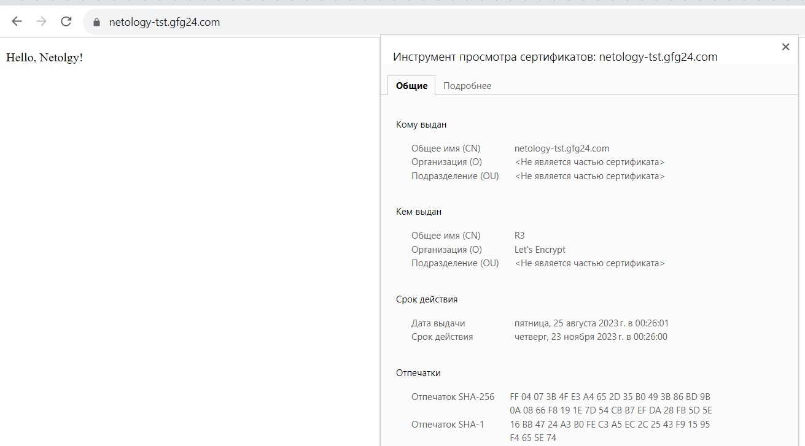

## Домашнее задание к занятию "15.3. Безопасность в облачных провайдерах"

## Задание 1. Yandex Cloud   

1. С помощью ключа в KMS необходимо зашифровать содержимое бакета:

 - создать ключ в KMS;
 - с помощью ключа зашифровать содержимое бакета, созданного ранее.
2. (Выполняется не в Terraform)* Создать статический сайт в Object Storage c собственным публичным адресом и сделать доступным по HTTPS:

 - создать сертификат;
 - создать статическую страницу в Object Storage и применить сертификат HTTPS;
 - в качестве результата предоставить скриншот на страницу с сертификатом в заголовке (замочек).

### Решение

Конфигурация Terraform располагается в папке [configs](./configs/).

1. Вывод успешного создания ключа в сервисе KMS и применения его к S3 бакету:

		<!---->

2. Вывод успешного создания и проверки прав на домен сертификата Let’s Encrypt:

		<!---->

		<!---->

Публичный Бакет с включенным хостингом статического сайта:

		<!---->

		<!---->

Добавление ранее созданного сертификата для включения HTTPS:

		<!---->

Проверка доступности сайта по HTTPS:

		<!---->

Код Terraform представлен в папке [configs](./configs/).