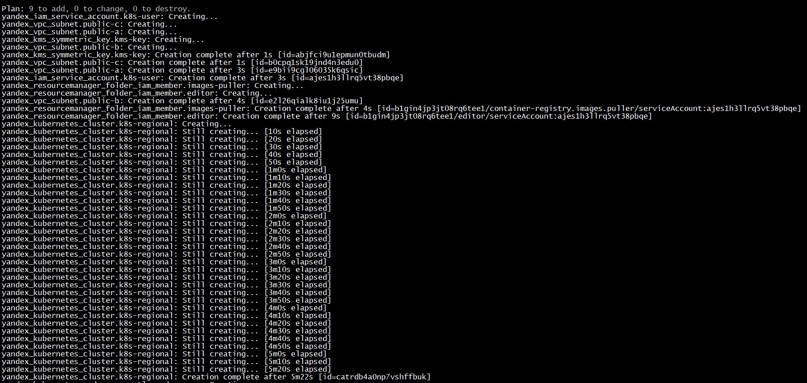

## Домашнее задание к занятию "15.3. Кластеры. Ресурсы под управлением облачных провайдеров"

## Задание 1. Yandex Cloud

1. Настроить с помощью Terraform кластер баз данных MySQL.

 - Используя настройки VPC из предыдущих домашних заданий, добавить дополнительно подсеть private в разных зонах, чтобы обеспечить отказоустойчивость. 
 - Разместить ноды кластера MySQL в разных подсетях.
 - Необходимо предусмотреть репликацию с произвольным временем технического обслуживания.
 - Использовать окружение Prestable, платформу Intel Broadwell с производительностью 50% CPU и размером диска 20 Гб.
 - Задать время начала резервного копирования — 23:59.
 - Включить защиту кластера от непреднамеренного удаления.
 - Создать БД с именем `netology_db`, логином и паролем.

2. Настроить с помощью Terraform кластер Kubernetes.

 - Используя настройки VPC из предыдущих домашних заданий, добавить дополнительно две подсети public в разных зонах, чтобы обеспечить отказоустойчивость.
 - Создать отдельный сервис-аккаунт с необходимыми правами. 
 - Создать региональный мастер Kubernetes с размещением нод в трёх разных подсетях.
 - Добавить возможность шифрования ключом из KMS, созданным в предыдущем домашнем задании.
 - Создать группу узлов, состояющую из трёх машин с автомасштабированием до шести.
 - Подключиться к кластеру с помощью `kubectl`.
 - *Запустить микросервис phpmyadmin и подключиться к ранее созданной БД.
 - *Создать сервис-типы Load Balancer и подключиться к phpmyadmin. Предоставить скриншот с публичным адресом и подключением к БД.

### Решение

Конфигурация Terraform располагается в папке [configs](./configs/).

1. Вывод успешного создания private подсетей и кластера MySQL:

		<!---->

 - Ноды кластера MySQL размещены в разных подсетях.
 - Предусмотрена репликацию с произвольным временем технического обслуживания.
 - Используется окружение Prestable, платформу Intel Broadwell с производительностью 50% CPU и размером диска 20 Гб.
 - Задано время начала резервного копирования — 23:59.
 - Включена защита кластера от непреднамеренного удаления.
 - Создана БД с именем `netology_db`, логином и паролем.

2. Вывод успешного создания public подсетей и кластера Kubernates:

		<!---->

		<!---->

- Создан отдельный сервис-аккаунт с необходимыми правами.
- Создан региональный мастер Kubernetes с размещением нод в трёх разных подсетях.
- Добавлена возможность шифрования ключом из KMS, созданным в предыдущем домашнем задании.
- Создана группу узлов, состоящую из трёх машин с автомасштабированием до шести.

Добавляем учетные данные в конфигурационный файл kubectl:

```
yc managed-kubernetes cluster \
get-credentials catrdb4a0np7vshffbuk \
--kubeconfig ~/.kube/ntlg_kubeconf \
--external
  ```

Вывод успешного подключение к кластеру с помощью `kubctl`:

		<!---->
