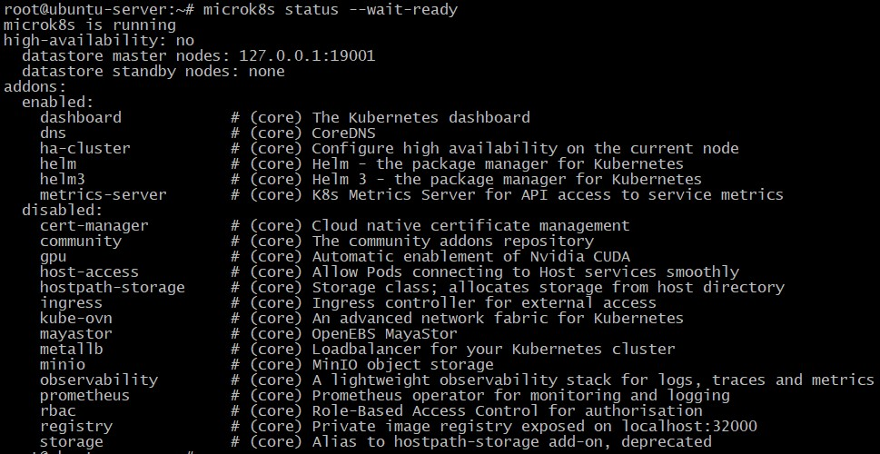
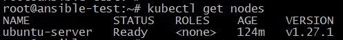
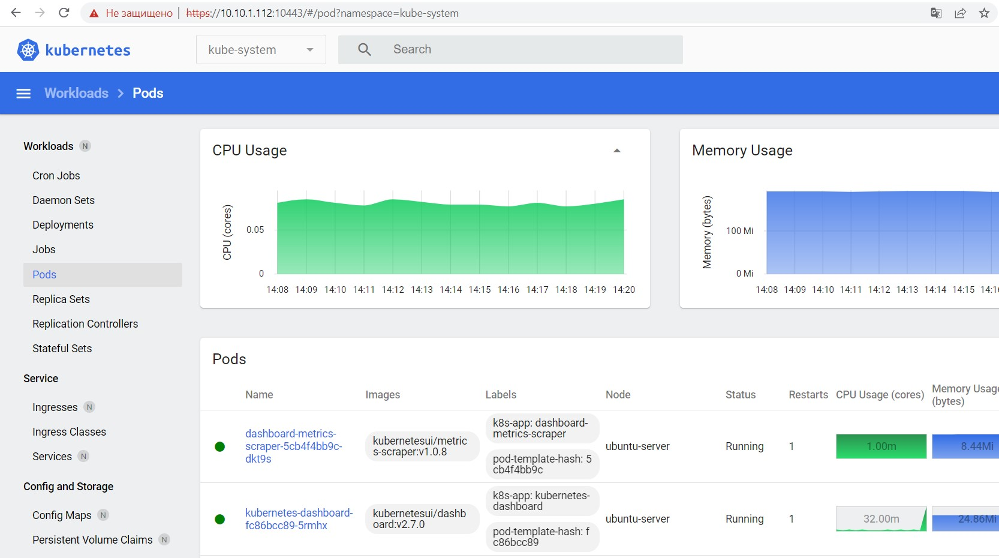

## Домашнее задание к занятию "12.1 Kubernetes. Причины появления. Команда kubectl"

Прилагаю конфиг-файл **config** для подключения к кластеру microk8s.

Статус Microk8s:

		<!---->

Вывод команды **kubectl get nodes**:

		<!---->

Скриншот Dashboard:

		<!---->