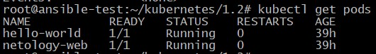
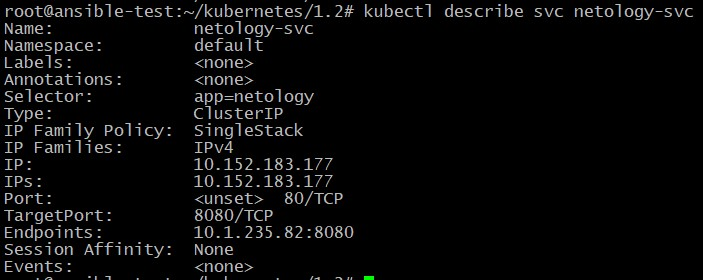
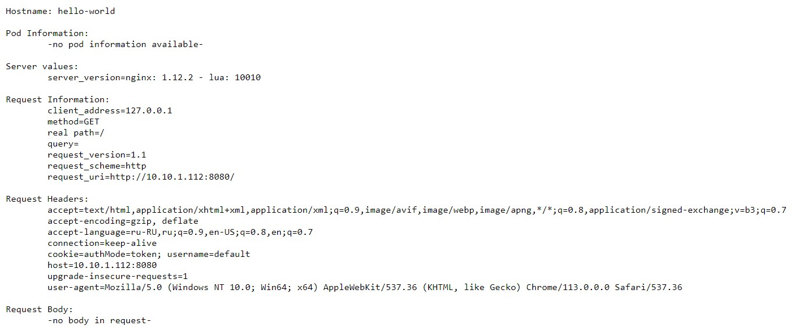

## Домашнее задание к занятию "12.2 Базовые объекты K8S"

Манифесты для создания Deployments располагаются в папке [configs](./configs/).

Вывод созданных подов:

		<!---->

Вывод информации по сервису **netology-web**:

		<!---->

Скриншот результата подключения:

		<!---->