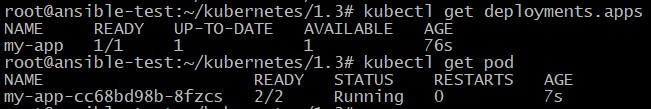
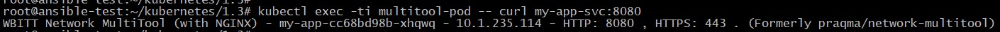
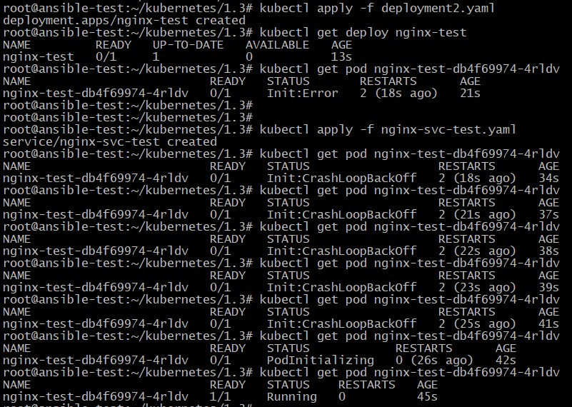

## Домашнее задание к занятию "12.3 Запуск приложений в K8S"

Манифесты располагаются в папке [configs](./configs/).

### Задание 1

1. Вывод запущенных подов после успешного выполнения Deployment:

		<!---->

2. Вывод запущенных подов после увеличения реплик до 2-х:

		<!---->

3. Вывод созданных сервисов:

		<!---->

4. Проверка доступа до подов с помощью отдельного пода multitool:

		<!---->

 - Проверка доступности nginx:

		<!---->

 - Проверка доступности multitool:

		<!---->

### Задание 2

Состояние пода до и после запуска сервиса:

		<!---->
