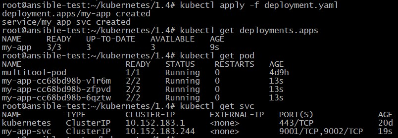
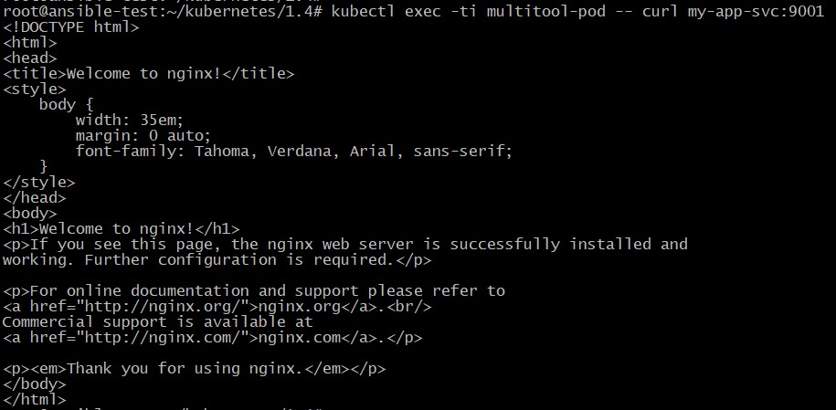
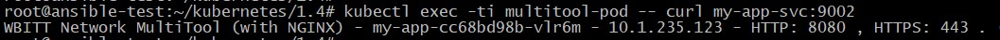
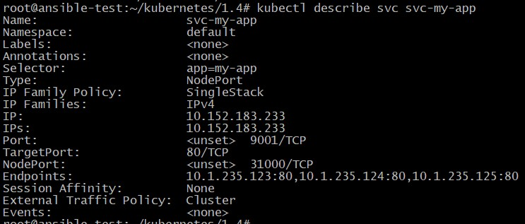
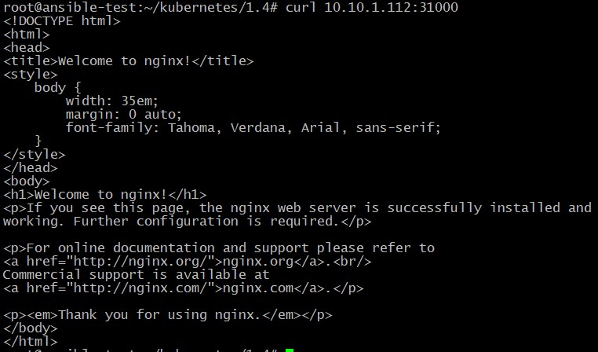

## Домашнее задание к занятию "12.4 Сетевое взаимодействие в K8S. Часть 1"

Манифесты располагаются в папке [configs](./configs/).

### Задание 1

1. Вывод успешного Deployment:

		<!---->

2. Проверка доступа до подов с помощью отдельного пода multitool:

 - Проверка доступности nginx:

		<!---->

 - Проверка доступности multitool:

		<!---->

### Задание 2

1. Вывод информации о сервисе с типом **NodePort**:

		<!---->

2. Проверка внешнего доступа к поду с nginx:

		<!---->
