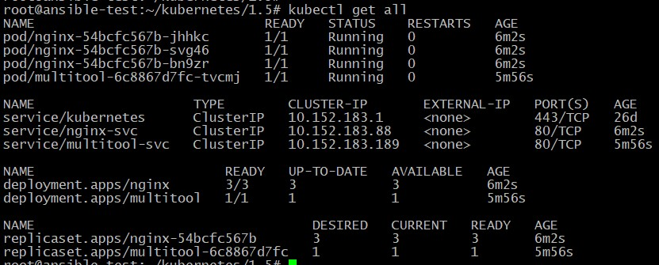
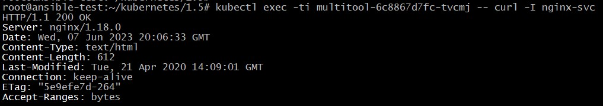
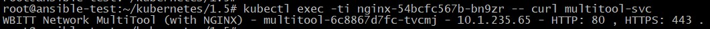
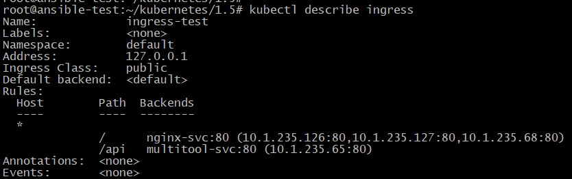
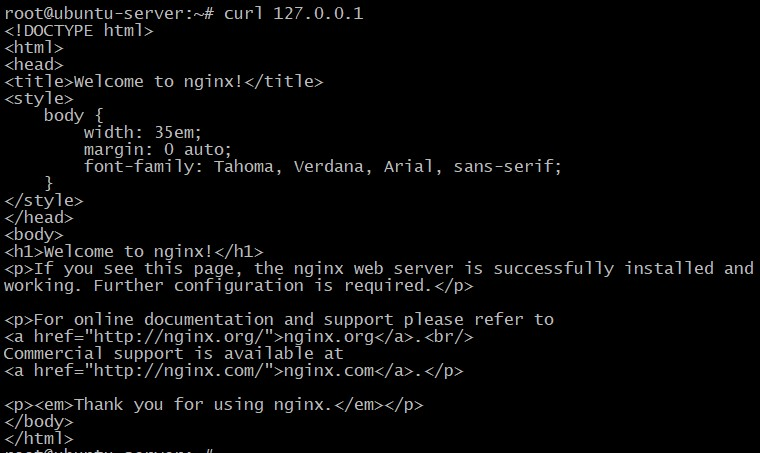
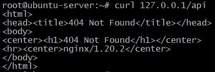

## Домашнее задание к занятию "12.5 Сетевое взаимодействие в K8S. Часть 2"

Манифесты располагаются в папке [configs](./configs/).

### Задание 1

1. Вывод успешных Deployments и Services:

		<!---->

2. Проверка наличия связи между приложениями:

 - Проверка доступности nginx:

		<!---->

 - Проверка доступности multitool:

		<!---->

### Задание 2

1. Включаем контроллер Ingress командой:

**microk8s enable ingress**

2. Вывод информации после создания объекта Ingress:

		<!---->

3. Проверка доступности приложений:

- frontend:

		<!---->

- backend:

		<!---->
