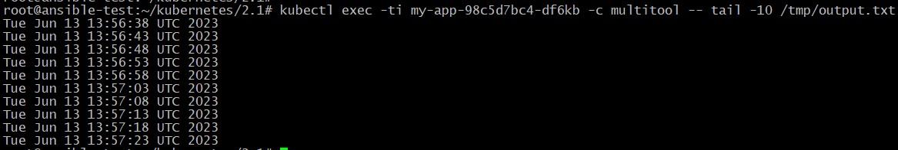
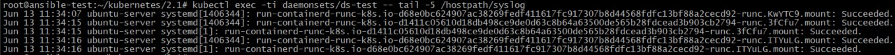

## Домашнее задание к занятию "13.1. Хранение в K8s. Часть 1"

Манифесты располагаются в папке [configs](./configs/).

### Задание 1

1. Вывод успешного создания Deployment:

		<!---->

2. Проверка наличия файла **/tmp/output.txt** в контейнере multitool:

		<!---->

### Задание 2

1. Вывод успешного создания DaemonSet:

		<!---->

2. Вывод файла хоста /var/log/syslog изнутри пода:

		<!---->
