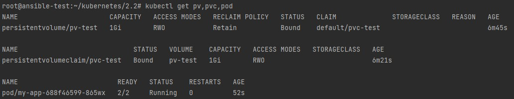
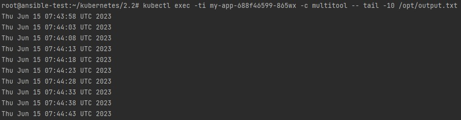
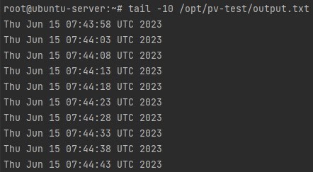
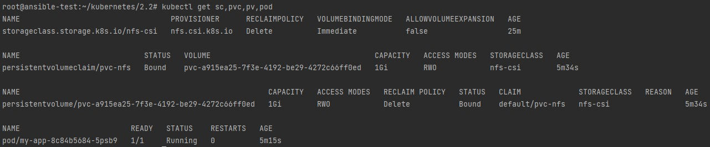
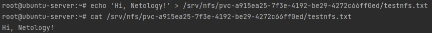
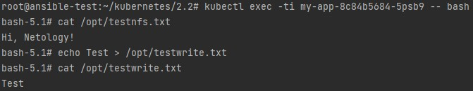

## Домашнее задание к занятию "13.2. Хранение в K8s. Часть 2"

Манифесты располагаются в папке [configs](./configs/).

### Задание 1

1. Вывод успешного создания Deployment:

		<!---->

2. Проверка наличия файла **/opt/output.txt** в контейнере multitool:

		<!---->

3. После удаления Deployment и PVC, PV перешел в статус Released. Когда PVC удаляется, PersistentVolume все еще существует, и том считается «Released», если reclaim policy равна Retain (по умолчанию). Этот PV пока недоступен для другой заявки, поскольку данные предыдущего заявителя остаются на сервере Microk8s в директории /opt/pv-test/output.txt.

		<!---->

4. После удаления PV, данные остаются на сервере Microk8s, так как reclaim policy Retain подразумевает ручное удаление данных.

### Задание 2

1. Вывод успешного создания Deployment:

		<!---->

2. Создаем текстовый с содержимым на NFS:

		<!---->

3. Возможность чтения и записи файла изнутри пода:

		<!---->

После удаления PVC, данные автоматически удаляются из NFS.