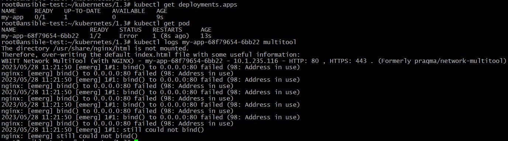
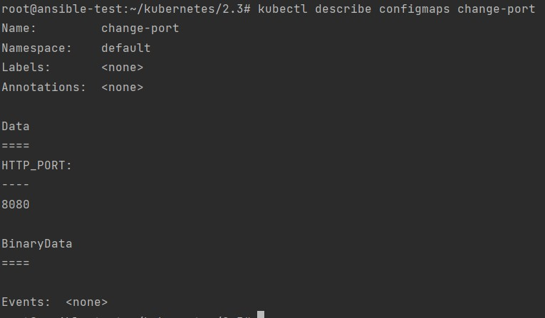
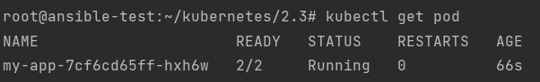
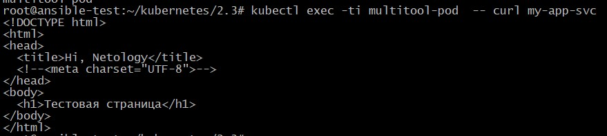
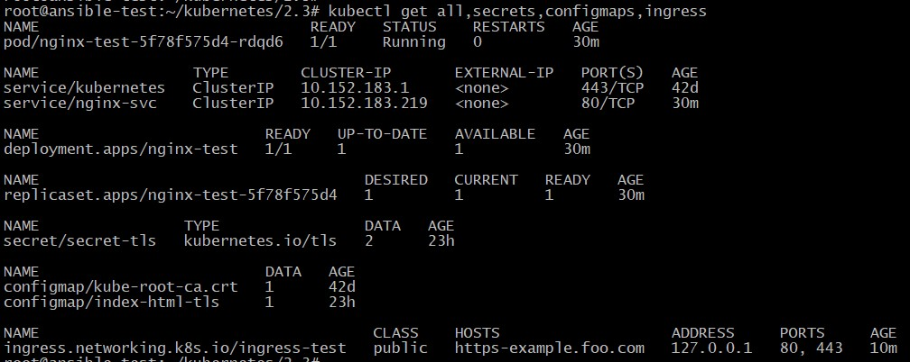
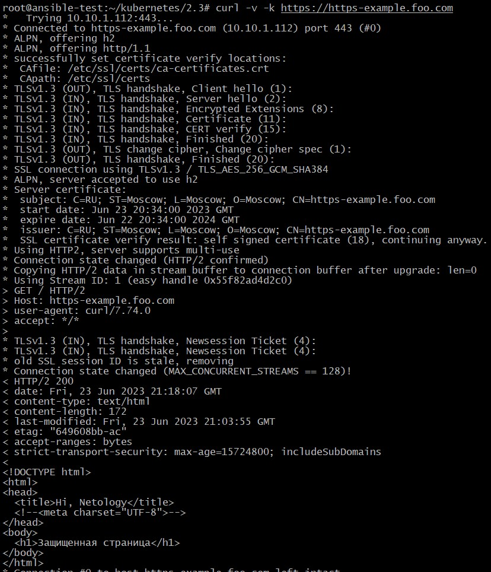

## Домашнее задание к занятию "13.3. Конфигурация приложений"

Манифесты располагаются в папке [configs](./configs/).

### Задание 1

1. Ошибка после создания 2-х контейнеров — nginx и multitool:

		<!---->

Ошибка происходит в связи с тем, что контейнер multitool пытается использовать уже занятый на адресе 0.0.0.0 порт 80. Для исправления ошибки создаем ConfigMap, в которой указываем переменную окружения HTTP_PORT со значение порта отличный от 80:

		<!---->

2. Вывод запущенных подов после успешного выполнения Deployment:

		<!---->

3. Вывод успешного подключения к тестовой страницы в Nginx с помощью отдельного Пода с multitool:

		<!---->

### Задание 2

1. Вывод успешного создания Deployment, Secret, ConfigMap, Ingress:

		<!---->

2. Вывод успешного подключения к сайту **https://https-example.foo.com** через Ingress:

		<!---->
