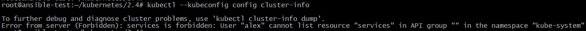
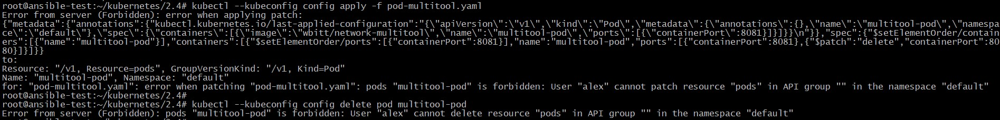

## Домашнее задание к занятию "13.4. КУправление доступом"

Манифесты располагаются в папке [configs](./configs/).

### Задание 1

1. Создал с помощью утилиты Openssl закрытый ключ и запрос на выдачу сертификата:

**openssl genrsa -out alex.key 4096**  
**openssl req -new -key alex.key -nodes -out alex.csr**

Создал и применил ресурс [CertificateSigningRequest](./configs/csr.yaml) csr.yaml для подписи запроса alex.csr:

		<!---->

2. Настроил конфигурационный файл [kubeconfig](./configs/config) для пользователя alex. Попытка подключиться к кластеру:

		<!---->

3. Создал [Role](./configs/role.yaml) и [RoleBinding](./configs/rolebinding.yaml) для возможности пользователю просматривать логи подов и их конфигурацию (kubectl logs pod <pod_id>, kubectl describe pod <pod_id>):

		<!---->

Неуспешные попытки выполнить другие действия над Подом:

		<!---->