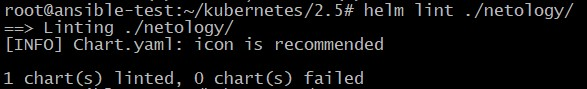
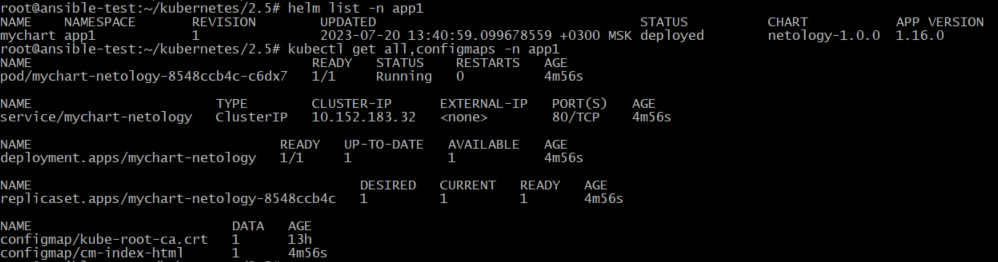
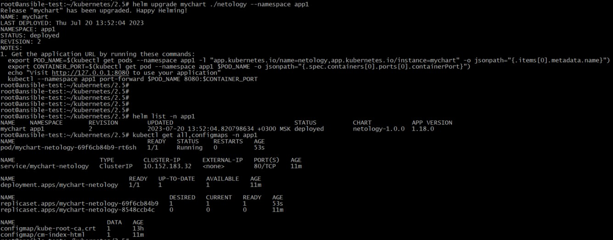
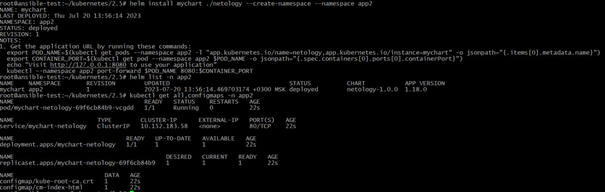
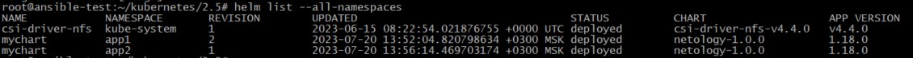

## Домашнее задание к занятию "13.5. Helm"

### Задание 1

Приложение Nginx версии 1.16.0 упаковано в чарт вервии 1.0.0.  
Архив с чартом расположен в каталоге [chart](./chart/)

### Задание 2

1. Проверка чарта с помощью команды **helm lint**:

		<!---->

Делаем сухой запуск для проверки наличия ошибок:

**helm install mychart ./netology --create-namespace --namespace app1 --dry-run**

2. Запуск чарта netology с версией Nginx 1.16.0 в namespace=app1:  

**helm install mychart ./netology --create-namespace --namespace app1**

Вывод успешного запуска:

		<!---->

3. Запуск чарта netology с версией Nginx 1.18.0 в namespace=app1. Для этого изменяем в файлах values.yaml и Chart.yaml значение версии Nginx с 1.16.0 на 1.18.0. Выполняем запуск:

**helm upgrade mychart ./netology --namespace app1**

Вывод успешного запуска:

		<!---->

3. Запуск чарта netology namespace=app2:

**helm install mychart ./netology --create-namespace --namespace app2**

Вывод успешного запуска:

		<!---->

Итог:

		<!---->
