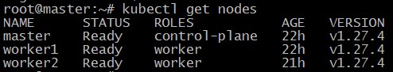
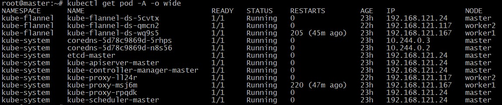
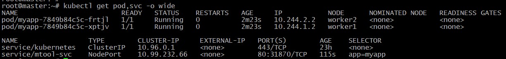

## Домашнее задание к занятию "14.2. Установка Kubernetes"

### Задание

Установка кластера k8s производилась с помощью инструмента **kubeadm**.

Установка необходимых компонентов кластера выполнялась согласно официальному руководству [Installing kubeadm](https://kubernetes.io/docs/setup/production-environment/tools/kubeadm/install-kubeadm/)

Инициализация Control plane:

```
kubeadm init --apiserver-advertise-address=192.168.121.24 \
--pod-network-cidr 10.244.0.0/16 --apiserver-cert-extra-sans=10.10.1.111 
```
Установка сетевого плагина Flannel:

```
kubectl apply -f https://raw.githubusercontent.com/flannel-io/flannel/master/Documentation/kube-flannel.yml
```

Добавление Worker nodes:

``
kubeadm join 192.168.121.24:6443 --token s5hif7.akgkffjm8kyh72at         --discovery-token-ca-cert-hash sha256:ec2ea10260f86d3afdbd771c34bdda67121c6e18a0cc21f95aa33e5085c9de0d
``

Проверка:

		<!---->

		<!---->

Тестовое развертывание:
```
kubectl create deployment myapp \
--image=wbitt/network-multitool --replicas 2

kubectl expose deployment myapp --name=mtool-svc \
--type NodePort --port 80 --target-port 80
```

		<!---->
