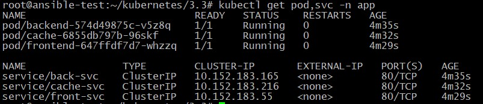
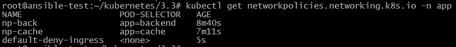
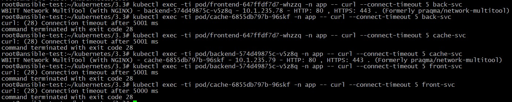

## Домашнее задание к занятию "14.3. Как работает сеть в K8s"

Манифесты располагаются в папке [configs](./configs/).

### Задание 1. Создать сетевую политику или несколько политик для обеспечения доступа

1. Создать deployment'ы приложений frontend, backend и cache и соответсвующие сервисы.
2. В качестве образа использовать network-multitool.
3. Разместить поды в namespace App.
4. Создать политики, чтобы обеспечить доступ frontend -> backend -> cache. Другие виды подключений должны быть запрещены.
5. Продемонстрировать, что трафик разрешён и запрещён.

### Решение

Вывод deployment'ов приложений frontend, backend и cache и соответсвующих сервисов в namespace app:

		<!---->

Применяем политику по умолчанию, котора запрещает весь входящий трафик на поды в namespace app и определяем политики, которые явно разрешают трафик по схеме:  
**rontend -> backend -> cache**

Список политик:

		<!---->

Проверяем:

		<!---->