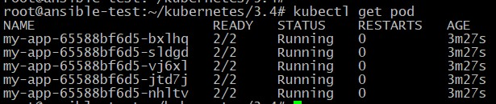
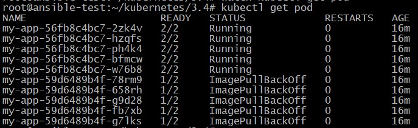
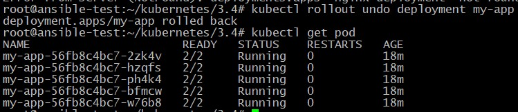

## Домашнее задание к занятию "14.4. Обновление приложений"

Манифесты располагаются в папке [configs](./configs/).

### Задание 1. Выбрать стратегию обновления приложения и описать ваш выбор

1. Имеется приложение, состоящее из нескольких реплик, которое требуется обновить.
2. Ресурсы, выделенные для приложения, ограничены, и нет возможности их увеличить.
3. Запас по ресурсам в менее загруженный момент времени составляет 20%.
4. Обновление мажорное, новые версии приложения не умеют работать со старыми.
5. Вам нужно объяснить свой выбор стратегии обновления приложения.

### Решение

Так как ресурсы, выделенные для приложения, ограничены, и нет возможности их увеличить, то нет возможности использовать стратегию Blue/green поскольку она требует дублирование ресурсов. В этом случае нам может подойти стратегия Recreate, RollingUpdate или Canary.  
В случае с Recreate поды вначале убиваются, а затем создаются новые, в связи с этим может быть перерыв в работе приложения.   
Во случае с RollingUpdate обновление производится постепенно и его нужно будет проводить в менее загруженное время, когда запас по ресурсам составляет 20%. Так как стратегия RollingUpdate вначале создает поды, а затем удаляет старые, то для выполнения этого условия можно в параметре maxUnavailable установить 20% а в параметре maxSurge 0, либо наоборот.
В случае с Canary обновление производится постепенно и его нужно будет проводить в менее загруженное время, когда запас по ресурсам составляет 20%. Но в этом случае нужно будет заранее развернуть новое приложение с расчетом ресурсов на 20% и постепенно увеличивать реплики и переключать клиентский трафик. Этот процесс более сложный по сравнению с предыдущими вариантами.

### Задание 2. Обновить приложение

1. Создать deployment приложения с контейнерами nginx и multitool. Версию nginx взять 1.19. Количество реплик — 5.
2. Обновить версию nginx в приложении до версии 1.20, сократив время обновления до минимума. Приложение должно быть доступно.
3. Попытаться обновить nginx до версии 1.28, приложение должно оставаться доступным.
4. Откатиться после неудачного обновления.

### Решение

Вывод работающего приложения:

		<!---->

Обновляем приложение до версии 1.20. Так как приложение должно быть доступно то используем стратегию RollingUpdate с параметрами:
```
maxSurge: 100%
maxUnavailable: 0
```
для проведения быстрого обновления.

Обновляем приложение до версии 1.28. Видим что обновление прошло неудачно:

		<!---->

Откатываемся:

		<!--![rollout(img/rollout.jpg)-->