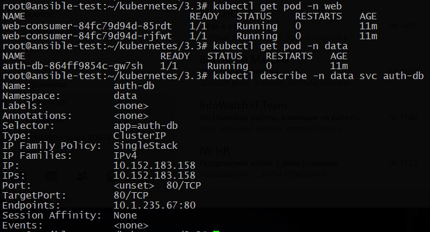
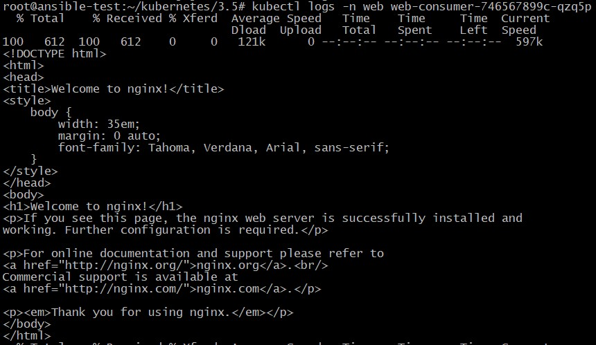

## Домашнее задание к занятию "14.5. Troubleshooting"

### Задание При деплое приложение web-consumer не может подключиться к auth-db. Необходимо это исправить


1. Установить приложение по команде:
```shell
kubectl apply -f https://raw.githubusercontent.com/netology-code/kuber-homeworks/main/3.5/files/task.yaml
```
2. Выявить проблему и описать.
3. Исправить проблему, описать, что сделано.
4. Продемонстрировать, что проблема решена.

### Решение

Вывод деплоя приложений:

		<!---->

Проверяем лог приложения **web-consumer** **командой kubectl logs -n web web-consumer-84fc79d94d-85rdt**:

`curl: (6) Couldn't resolve host 'auth-db'
`

Видим, что под не смог разрезолвить имя auth-db. Т.к. данный сервис находится в другом namespace, к нему необходимо обращаться по полному доменному имени или с указанием namespace в имени:

**auth-db.data.svc.cluster.local**

Редактируем конфигурацию Deployment web-consumer командой:

`kubectl edit -n web deployments.apps web-consumer`

Проверяем:

		<!---->