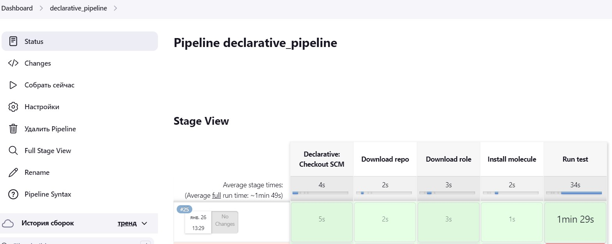
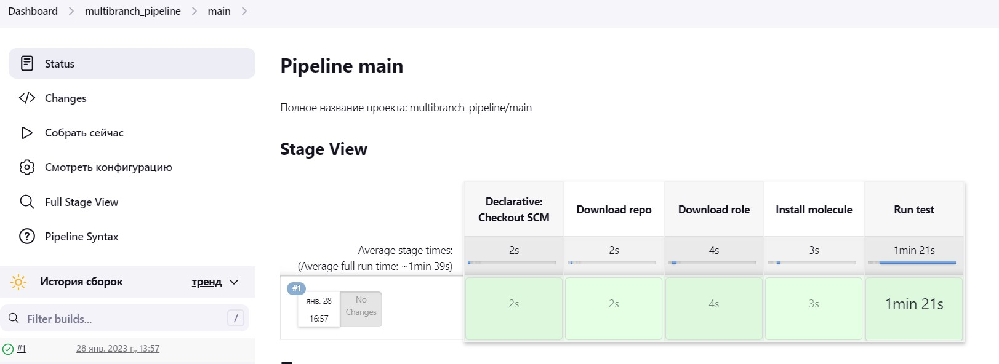
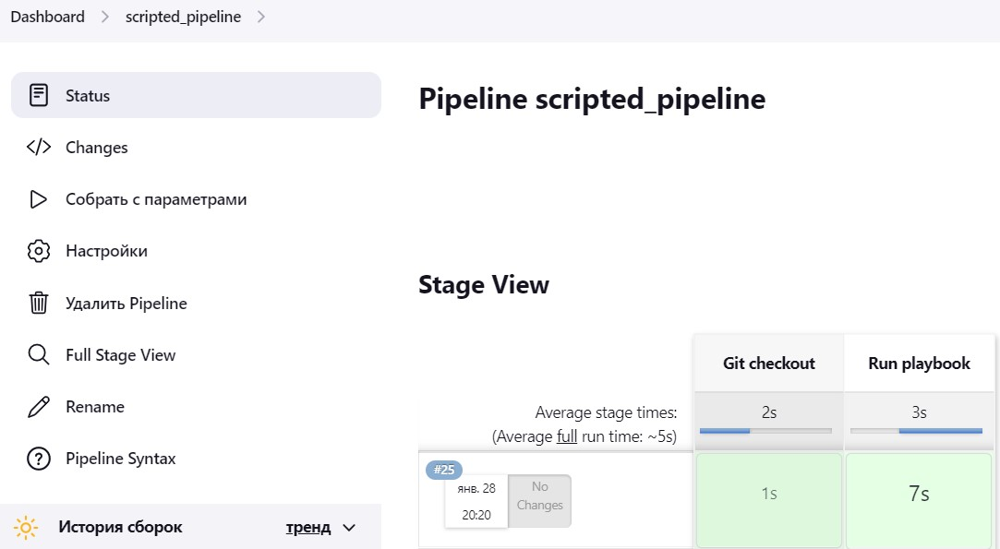

## Домашнее задание к занятию "9.4 Jenkins"

Ссылка на репозиторий с ролью и Declarative Pipeline и Scripted Pipeline:
**https://github.com/Owirtifo/filebeat-molecule**

Результат выполнения Declarative Pipeline:

		<!---->

Результат выполнения Multibranch Pipeline:

		<!---->

Результат выполнения Scripted Pipeline:

		<!---->