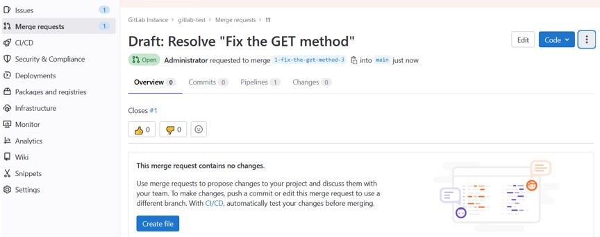

## Домашнее задание к занятию "9.6 Gitlab"

1. Развернут под pod kubernetes на основе образа python-api:

		<!---->

		<!---->

2. Открыт Issue с меткой feature на изменение метода GET:

		<!---->

		<!---->

3. Создан Merge request с новой веткой для доработки:

		<!---->

Внесены изменения в код:

		<!---->

Вливаем изменения в ветку main:

		<!---->

Проверяем, что сборка прошла успешно:

		<!---->

4. Проверяем работу приложения:

		<!---->

Закрываем Issue:

		<!---->