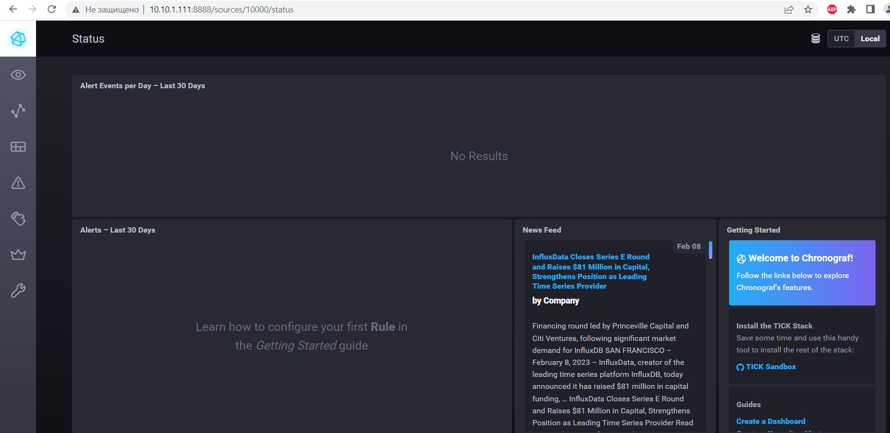

## Домашнее задание к занятию "10.2 Системы мониторинга"

1. Основные плюсы и минусы pull и push систем мониторинга:

### Push-модель

- Плюсы:

  - Упрощение репликации данных в разные системы мониторинга или их резервные копии (на клиенте настраивается конечная точка отправки или набор таких точек);
  - Более гибкая настройка отправки пакетов данных с метриками (на каждом клиенте задается объем данных и частота отправки);
  - UDP является менее затратным способом передачи данных, вследствие чего может вырасти производительность сбора метрик (обратной стороной медали является гарантия доставки пакетов);
  - Агенты push-модели изначально защищены от удаленных атак, поскольку они не прослушивают сетевые подключения;
  - Для агентов требуется минимальная настройка: интервал опроса и адрес коллектора. Firewall должен быть настроен для однонаправленной передачи измерений от агентов к коллектору.

- Минусы:

  - Нельзя настроить единый proxy-server с поддержкой TLS для обеспечения подлинности полученных данных;
  - Может возникнуть проблема производительностью системы мониторинга в связи с одновременной отправкой большого количества данных агентами.
  - Сложнее выполнять отладку полученных данных от агентов.
  - Относительно негибкий: периодически экспортируется предварительно определенный, фиксированный набор метрик.

### Pull-модель

- Плюсы:

  - Легче контролировать подлинность данных (гарантия опроса только тех агентов, которые настроены в системе мониторинга);   
  - Можно настроить единый proxy-server до всех агентов с TLS (таким образом, мы можем разнести систему мониторинга и агенты, с гарантией безопасности их взаимодействия);   
  - Упрощенная отладка получения данных с агентов (так как данные запрашиваются посредством HTTP, можно самостоятельно запрашивать эти данные, используя ПО вне системы мониторинга);
  - Нет проблем с перегрузкой очередей, так как сама система забирает данные.
  - Гибкость. Система мониторинга может запросить любую метрику в любое время.

- Минусы:

  - Сложно организовать репликацию данных между разными системами мониторинга или их резервными копиями;
  - Нагрузка на систему мониторинга увеличивается с увеличением опрашиваемых устройств;
  - Firewall должен быть настроен для обеспечения двунаправленной связи между системой мониторинга и агентами.
  - Сложнее настраивать;   
  - Использование менее быстрого сетевое взаимодействие по протоколу TCP.

2. Какие из ниже перечисленных систем относятся к push модели, а какие к pull? А может есть гибридные?
- Prometheus - Pull модель
- TICK - push модель (Telegraf можно настроить для работы в
соответствии с Pull моделью)
- Zabbix - работает с Pull и Push моделью
- VictoriaMetrics - работает с Pull и Push моделью
- Nagios - работает с Pull и Push моделью
3. Вывод запущенного TICK-стэка:

- curl http://localhost:8086/ping

		<!---->

- curl http://localhost:8888

		<!---->

- curl http://localhost:9092/kapacitor/v1/ping

		<!---->

- chronograf:

		<!---->

4. Скриншот с отображением метрик утилизации места на диске:

		<!---->

5. Скриншот measurments со списком метрик Docker:

		<!---->
