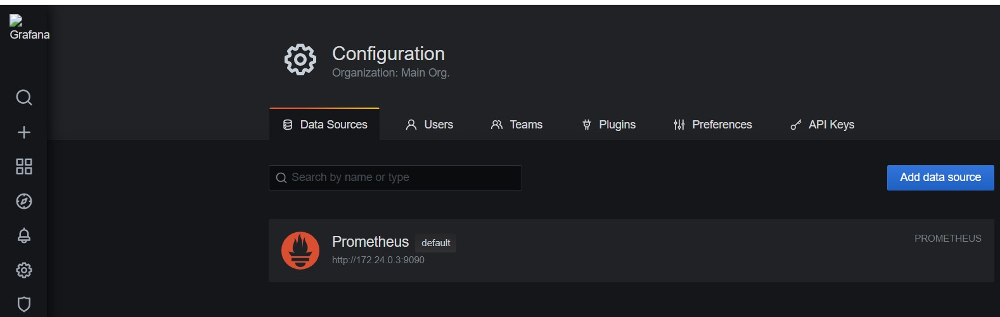
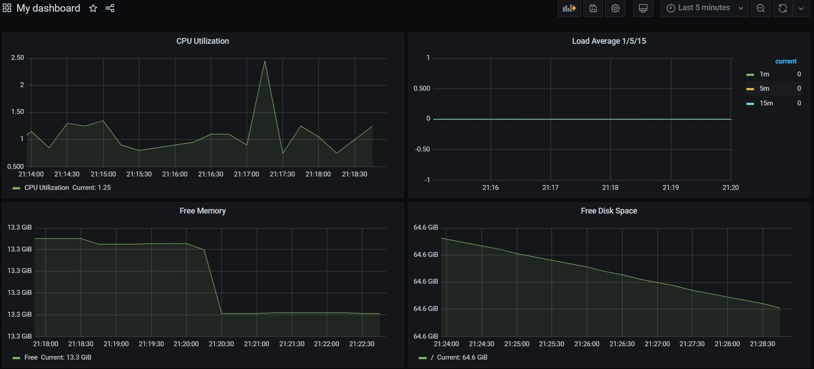
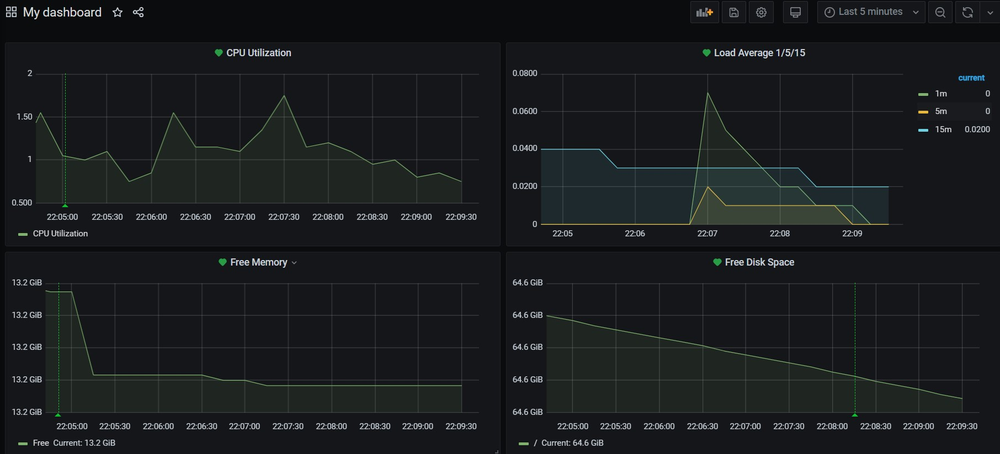

## Домашнее задание к занятию "10.3 Grafana"

1. Список подключенных Datasource:

		<!---->

2. Примеры запросов:

- Утилизация CPU для nodeexporter:

`(1 - avg(irate(node_cpu_seconds_total{mode="idle"}[5m]))) * 100`

- CPULA 1/5/15:

Load Average 1: `node_load1`  
Load Average 5: `node_load5`  
Load Average 15: `node_load15`

- Количество свободной оперативной памяти:

`node_memory_MemFree_bytes`

- Количество места на файловой системе:

`node_filesystem_avail_bytes{fstype=~"ext4"}`

Получившийся дашбоард:

		<!----> 

3. Дашборд с настроенныеми Alerts:

		<!----> 

4. Код дашборда в формате JSON расположен в файле **my_dashboard.json**