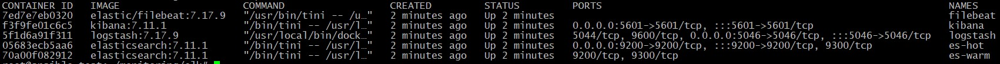
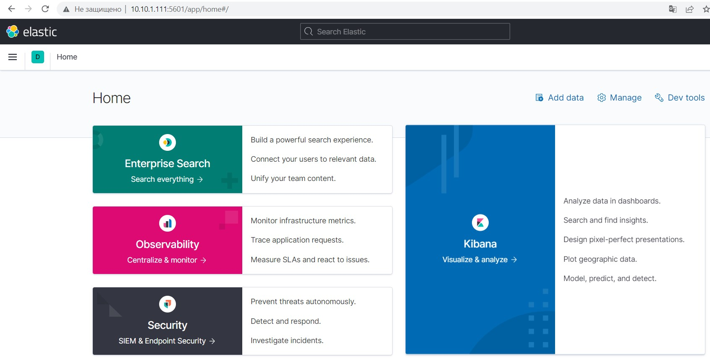
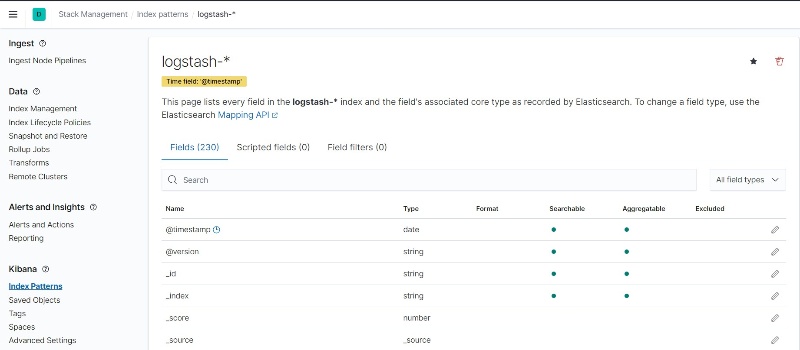
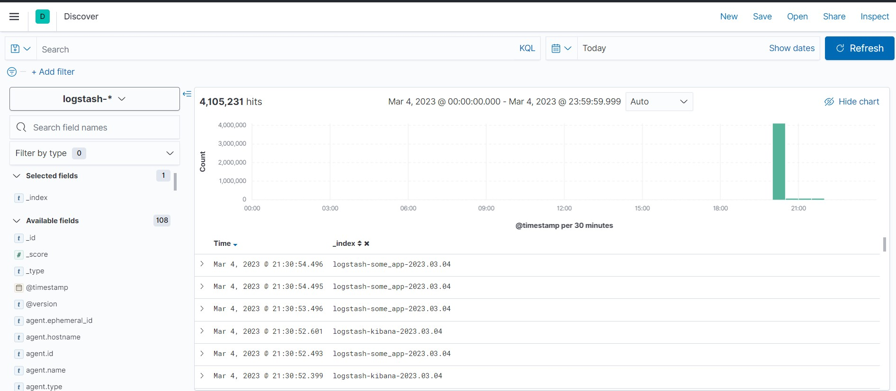

## Домашнее задание к занятию "10.4 ELK"

1. **Задание 1**
- скриншот docker ps через 5 минут после старта всех контейнеров:

		<!---->

- скриншот интерфейса Kibana:

		<!---->

2. **Задание 2**

- скриншот Kibana Index Patterns:

		<!---->

- скриншот Kibana Discover:

		<!---->