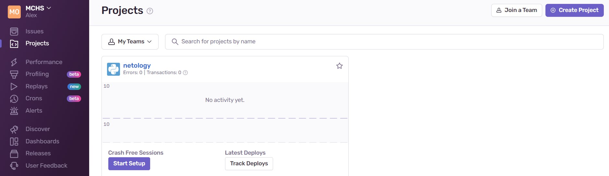
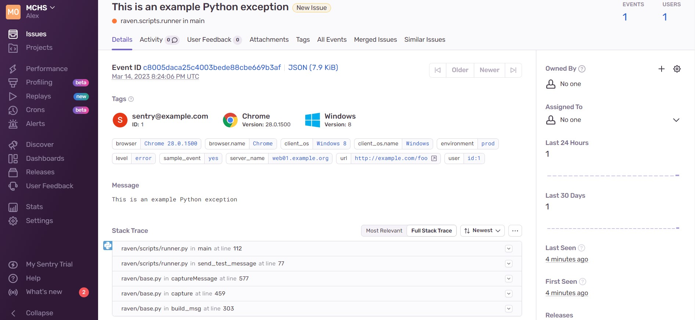
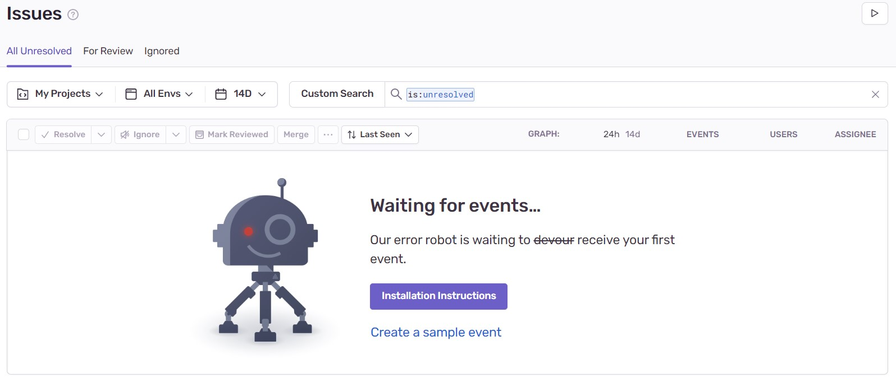
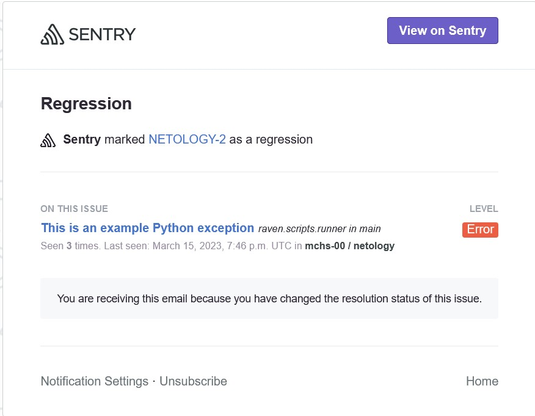

## Домашнее задание к занятию "10.5 Sentry"

1. Регистрация в sentry.io:

		<!---->

2. **Задание 2**

- скриншот Stack trace тестового события:

		<!---->

- скриншот списка событий проекта, после нажатия Resolved:

		<!---->

3. Скриншот тела сообщения из оповещения на почте:

		<!---->