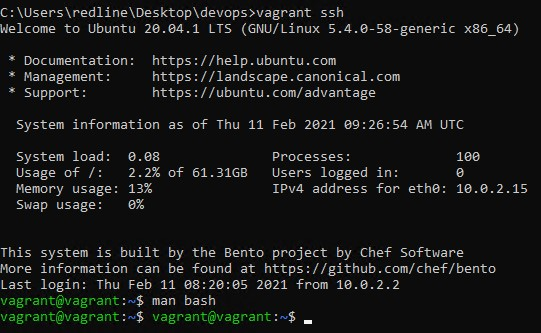

## Домашнее задание к занятию "3.1. Работа в терминале, лекция 1"

ДЗ выполнял с помощью запущенной Ubuntu в VirtualBox посредством Vagrant 

8. history [n] в строке 2593 man bash  
Используется в HISTCONTROL. ignoreboth — устанавливает значания ignorespace и ignoredups, т.е. не сохранять строки начинающиеся с символа <пробел> и не сохранять строки, совпадающие с последней выполненной командой
9. { list; } строка 197  
Arrays  
На любой элемент массива можно ссылаться с помощью ${name[subscript]} Строка 709  
Brace Expansion  
{} - это механизм, с помощью которого могут быть сгенерированы произвольные строки. Строка 746  
Например, mkdir /usr/local/src/bash/{old,new,dist,bugs}  
Parameter Expansion ${parameter} строка 792
10. touch /home/vagrant/{1..10000}  
touch ./{1..300000}  
-bash: /usr/bin/touch: Argument list too long
11. [[ Возвращает состояние 0 или 1 в зависимости от оценки выражения условного выражения.   
[[ -d /tmp ]] проверяет, есть ли директория /tmp
12. export PATH=/tmp/new_path_directory/:$PATH
13. at - выполняет команды в заданное время.  
batch - выполняет команды, когда позволяют уровни нагрузки системы; другими словами, когда среднее значение нагрузки падает ниже 1,5 или значения, указанного в вызове atd.
