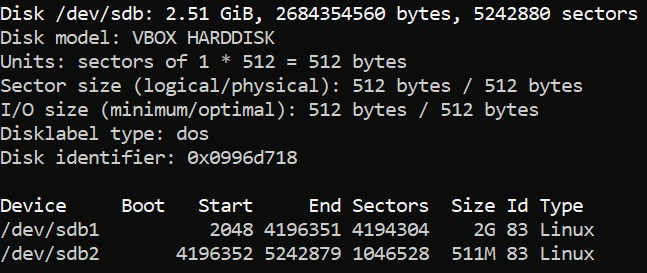
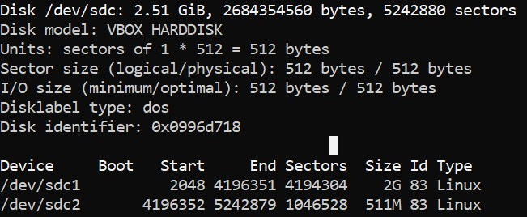
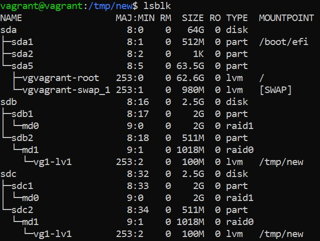
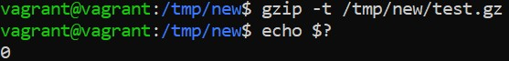
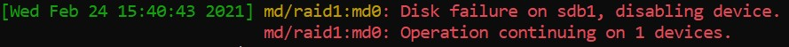
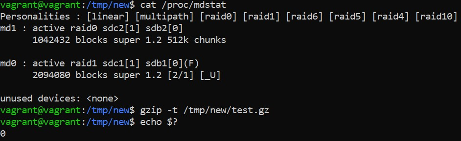

## Домашнее задание к занятию "3.5. Файловые системы"

2\. Жесткая ссылка и файл, для которой она создавалась имеют одинаковые inode. Поэтому жесткая ссылка имеет те же права доступа, владельца и время последней модификации, что и целевой файл.  
4\.   
5. sfdisk -d /dev/sdb | sfdisk /dev/sdc  
  
6. mdadm --create --verbose /dev/md0 --level=1 --raid-devices=2 /dev/sdb1 /dev/sdc1  
7. mdadm --create --verbose /dev/md1 --level=0 --raid-devices=2 /dev/sdb2 /dev/sdc2  
8. pvcreate /dev/md0 /dev/md1  
9. vgcreate vg1  /dev/md0 /dev/md1  
10. lvcreate -L 100M -n lv1 vg1 /dev/md1  
11. mkfs.ext4 /dev/vg1/lv1  
12. mount /dev/vg1/lv1 /tmp/new/  
14. 	<!---->   
15. 	<!---->   
16. pvmove /dev/md0 /dev/md1  
17. mdadm --fail /dev/md0 /dev/sdb1  
18. 	<!---->   
19. 	<!----> 