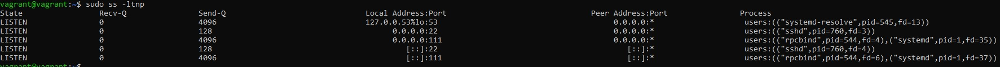

## Домашнее задание к занятию "3.6. Компьютерные сети, лекция 1"

2. 1, 6 и 11  
В частотном диапазоне 5 ГГц доступно 23 неперекрывающихся канала
3. Apple, Inc
4. 8949 байт
5. Сочетание символов SYN и FIN, установленных в заголовке TCP, является неприемлимым, поскольку оно требует как установления соединения (через SYN), так и завершения соединения (через FIN). Таким образом можно обойти firewall.
6. TIME-WAIT не может присутствовать для UDP соединения.
7. FIN-WAIT-1 - Клиент завершает соединение, отправив сегмент с флагом FIN
CLOSE-WAIT - Сервер переходит в это состояние, отправив, в свою очередь сегмент ACK  
FIN-WAIT-2 - Клиент получает ACK и ждёт получения сегмента с флагом FIN  
LAST-ACK - Сервер заканчивает передачу и отправляет сегмент с флагом FIN  
TIME-WAIT - Клиент получил сегмент с флагом FIN, отправил сегмент с флагом ACK  
CLOSING - Обе стороны инициировали закрытие соединения одновременно: после отправки сегмента с флагом FIN узел-1 также получает сегмент FIN, отправляет ACK и находится в ожидании сегмента ACK (подтверждения на свой запрос о разъединении)
8. 65535 соединений. Если ограничиваться только параметрами L4, то сервер сможет обслужить = количество_клиентов*65535
9. Главная опасность, которою несет разрастание очереди TIME_WAIT на сервере — это исчерпание ресурсов. Кроме того могут быть неприятные инциденты и при работе с NAT-клиентами.
10. Тем, что по UDP работают Realtime протоколы, которые могут переносить видео, голос и тд. Вследствиие чего могут быть потери пакетов, так как нет гарантированной доставки.
11. TCP, т.к. необходима будет гарантированная доставка логов.
12. 	<!----> 
13. tcpdump -A - содержимое фреймов в текстовом виде  
tcpdump -X - в шестнадцатиричном формате
14. Встретился Flags: 0x4000, Don't fragment. Стандарт называется Ethernet II. OUI можно увидеть в полях Source и Destination 2 уровня.