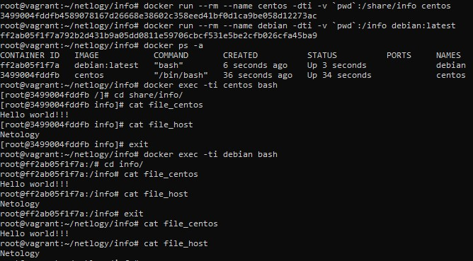

## Домашнее задание к занятию "5.3. Контейнеризация на примере Docker"

1. 
- Высоконагруженное монолитное java веб-приложение - физическая машина. Лучшая производительность и отказоустойчивость. Также подойдет и виртуальная машина. Минус всего этого - цена.
- Go-микросервис для генерации отчетов - Docker. Легкость сборки, минимальное ПО, производительность, цена.
- Nodejs веб-приложение - Docker. Легкость сборки, минимальное ПО, производительность, цена. 
- Мобильное приложение c версиями для Android и iOS - Docker тут наверно подойдет только для сборки. Запуск приложения в контейнере невозможен, нужно либо мобильное устройство, либо специальная виртуальная машина.
- База данных postgresql используемая, как кэш - Docker. Не нужно хранить данные, производительность.
- Шина данных на базе Apache Kafka - виртуальная машина или физическая машина. Необходимо хранение данных, лучшая производительность и отказоустойчивость.
- Очередь для Logstash на базе Redis - Docker. Легкость сборки, минимальное ПО, производительность, цена. 
- Elastic stack для реализации логирования продуктивного веб-приложения - три ноды elasticsearch, два logstash и две ноды kibana - виртуальная машина. Но думаю Docker тоже, либо совместно с виртуальными машинами. Прошу помочь
- Мониторинг-стек на базе prometheus и grafana - Docker. Легкость сборки, минимальное ПО, производительность, цена. Виртуальная машина тоже подойдет. 
- Mongodb, как основное хранилище данных для java-приложения - виртуальная машина. Хранение данных, отказоустойчивость, производительность. Подойдет и физическая машина.
- Jenkins-сервер - Docker. Легкость сборки, минимальное ПО, производительность, цена. 
2. https://hub.docker.com/r/owirtifo/apache
3. 	<!---->  