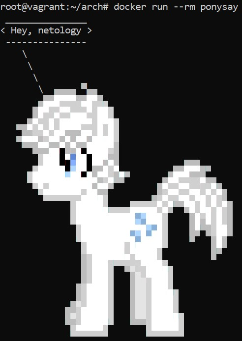
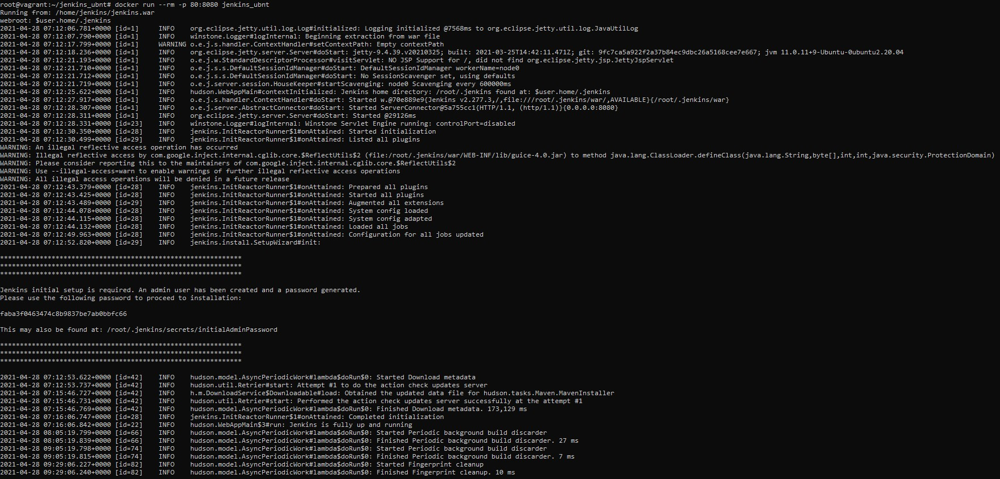
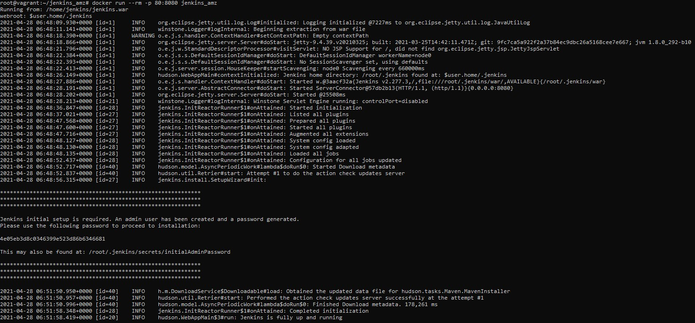
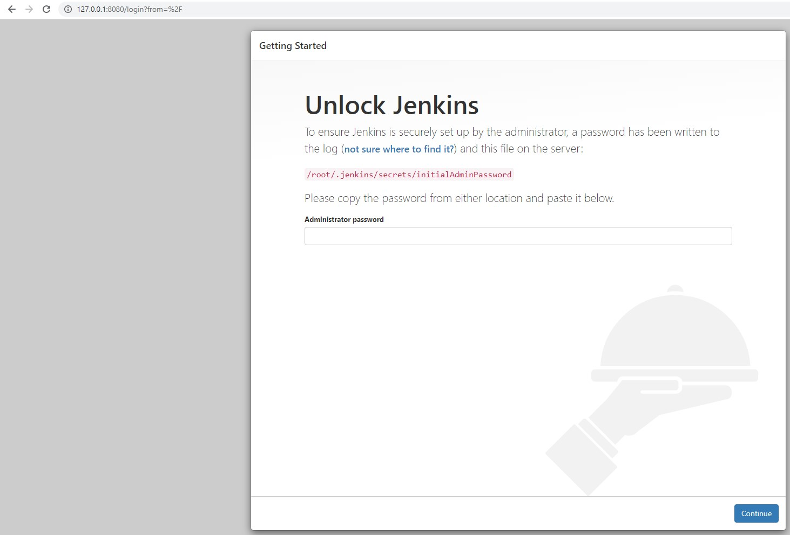
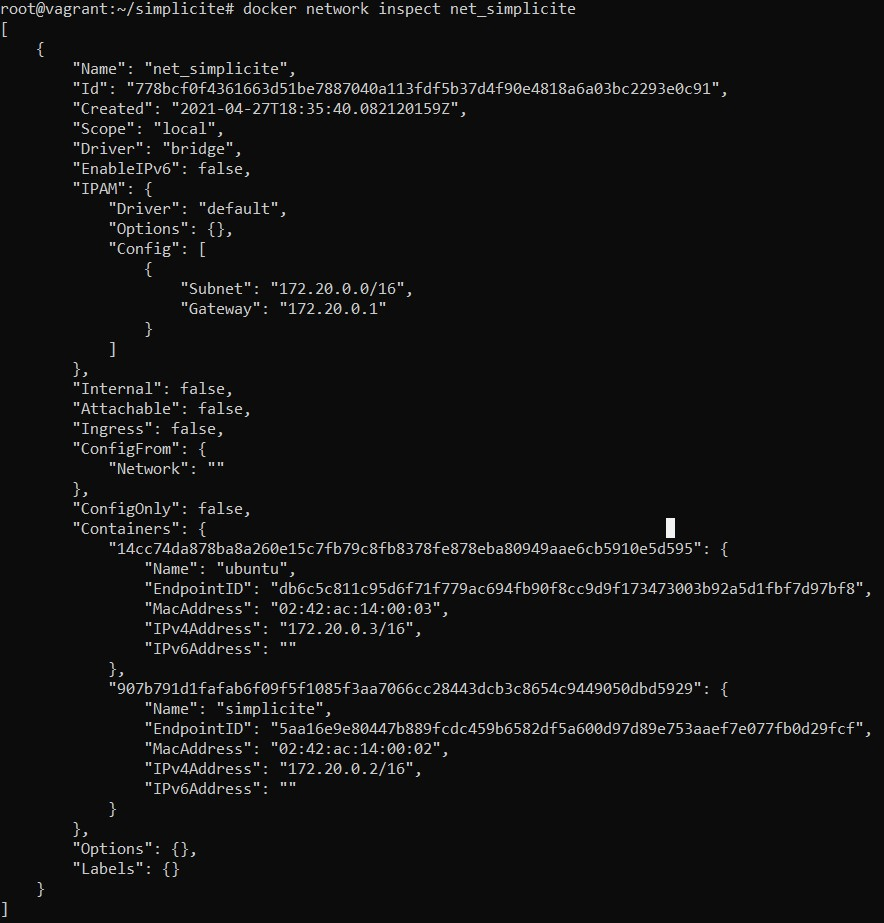
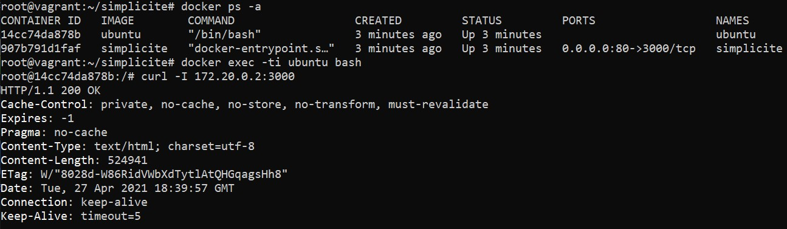

## Домашнее задание к занятию "5.4. Практические навыки работы с Docker"

1. 
**Dockerfile Ponysay:**
```
FROM archlinux:latest

RUN pacman -Sy --noconfirm ponysay

ENTRYPOINT ["/usr/bin/ponysay"]
CMD ["Hey, netology"]
```

**Скриншот:**

	<!---->  

**Ссылка на образ:**

https://hub.docker.com/r/owirtifo/ponysay

2. 
**Dockerfile Ubuntu:**
```
FROM ubuntu:ver2

WORKDIR /home/jenkins

RUN apt-get update && \
apt-get install -y wget && \
apt-get install -y openjdk-11-jdk && \
wget https://get.jenkins.io/war-stable/2.277.3/jenkins.war -nv && \
apt-get clean && rm -rf /var/lib/apt/lists/*

ENTRYPOINT ["/usr/bin/java", "-jar", "jenkins.war"]

EXPOSE 8080/tcp
```
**Dockerfile Amazoncorretto:**
```
FROM amazoncorretto:ver1

WORKDIR /home/jenkins

RUN yum update -y && \
yum install -y wget && \
wget https://get.jenkins.io/war-stable/2.277.3/jenkins.war -nv && \
yum clean all

ENTRYPOINT ["/usr/bin/java", "-jar", "jenkins.war"]

EXPOSE 8080/tcp
```
**Скриншот лога Ubuntu:**

	<!----> 

**Скриншот лога Amazoncorretto:**

	<!----> 

**Скриншоты веб-интерфейса Jenkins:**

	<!----> 

**Ссылка на образ Ubuntu:**

https://hub.docker.com/r/owirtifo/jenkins_ubnt

**Ссылка на образ Amazoncorretto:**

https://hub.docker.com/r/owirtifo/jenkins_amz

3. 
**Dockerfile Simplicite:**
```
FROM node

RUN git clone https://github.com/simplicitesoftware/nodejs-demo.git && \
cd /nodejs-demo && \
sed -i 's/localhost/0.0.0.0/g' app.js && \
npm install

WORKDIR /nodejs-demo

CMD ["npm", "start"]

EXPOSE 3000
```

**Скриншот вывода вызова команды списка docker сетей:**

	<!----> 

**Скриншот вызова утилиты curl:**

	<!----> 
