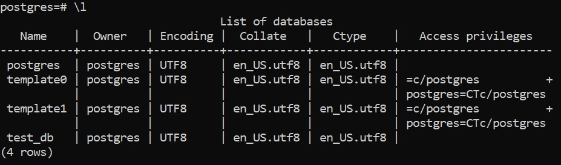
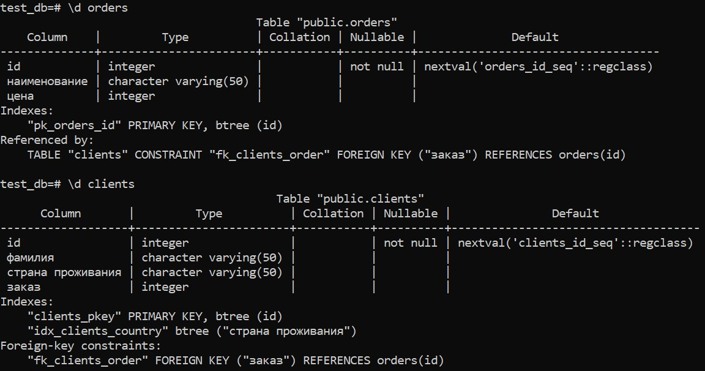
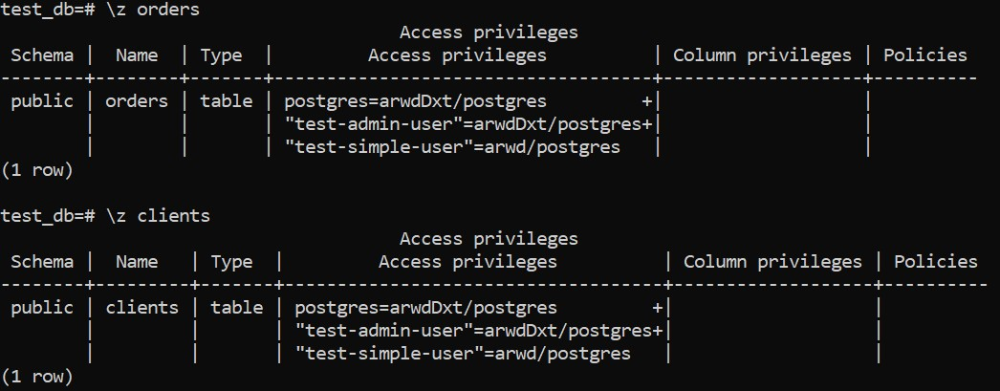
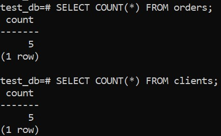
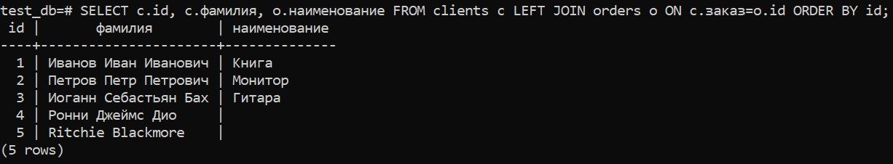
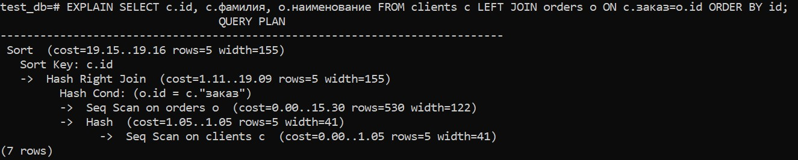

## Домашнее задание к занятию "6.2. SQL"

1. 
    docker run --rm --name postgre -v db-vl:/var/lib/postgresql/data -v bk-vl:/backup -dti -e POSTGRES_PASSWORD=admin  postgres:12
2. 
Список БД:
		<!----> 

Описание таблиц:
		<!----> 

SQL-запрос для выдачи списка пользователей с правами над таблицами test_db:
```
SELECT grantee as user, table_name, privilege_type
FROM information_schema.role_table_grants
WHERE table_name='orders' OR table_name='clients'
GROUP BY grantee, table_name, privilege_type;
```
Список пользователей с правами над таблицами test_db:
	<!----> 
3.  
	<!---->  
4. 

````
UPDATE clients SET заказ = CASE WHEN фамилия='Иванов Иван Иванович' THEN (SELECT id FROM orders WHERE наименование='Книга')
WHEN фамилия='Петров Петр Петрович' THEN (SELECT id FROM orders WHERE наименование='Монитор')
WHEN фамилия='Иоганн Себастьян Бах' THEN (SELECT id FROM orders WHERE наименование='Гитара')
END;
````
    SELECT c.id, c.фамилия, o.наименование FROM clients c LEFT JOIN orders o ON c.заказ=o.id ORDER BY id;
	
	<!----> 

5. 

    EXPLAIN SELECT c.id, c.фамилия, o.наименование FROM clients c LEFT JOIN orders o ON c.заказ=o.id ORDER BY id;
	
	<!----> 

cost – ожидаемая стоимость выполнения оператора, которая показывает, сколько, по мнению планировщика, будет выполняться этот оператор (это значение измеряется в единицах стоимости). Первое значение — затраты на получение первой строки. Второе — затраты на получение всех строк.  
rows — приблизительное количество возвращаемых строк при выполнении операции Seq Scan. Это значение возвращает планировщик.  
width — средний размер одной строки в байтах.

6. 
Создание резервной копии БД test_db:
    pg_dump test_db > /backup/test_db.dump
	
	pg_dumpall > /backup/test_db.dumpall

Восстановление БД test_db:
    createdb test_db
    psql test_db < /backup/test_db.dump

    psql -f /backup/test_db.dumpall postgres

