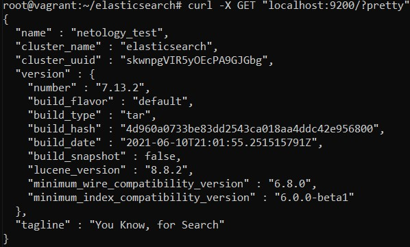
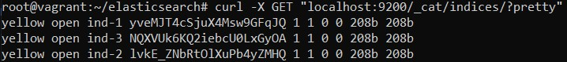
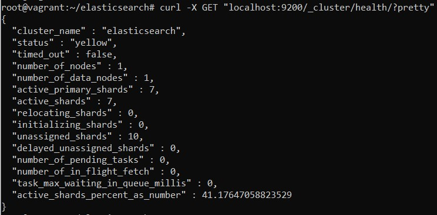
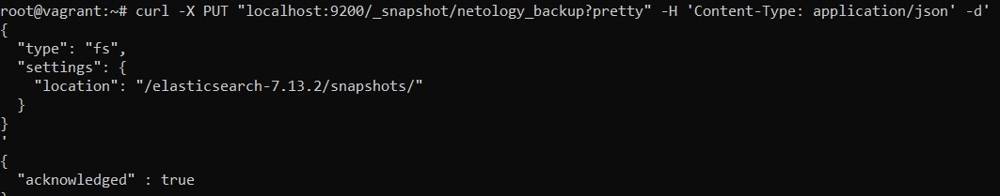
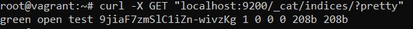
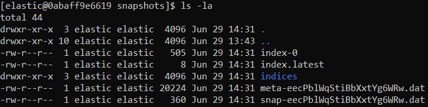
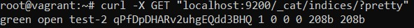
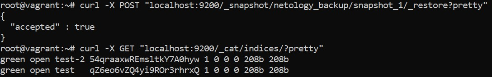

## Домашнее задание к занятию "6.5. Elasticsearch"

1. Dockerfile:
```
FROM centos:7

ADD https://artifacts.elastic.co/downloads/elasticsearch/elasticsearch-7.13.2-linux-x86_64.tar.gz /
ADD https://artifacts.elastic.co/downloads/elasticsearch/elasticsearch-7.13.2-linux-x86_64.tar.gz.sha512 /
RUN yum update -y && \
yum install perl-Digest-SHA -y && \
shasum -a 512 -c elasticsearch-7.13.2-linux-x86_64.tar.gz.sha512 && \
tar -xzf elasticsearch-7.13.2-linux-x86_64.tar.gz && \
rm -f elasticsearch-7.13.2-linux-x86_64.tar.* && \
useradd elastic && \
chown -R elastic: /elasticsearch-7.13.2/ && \
chmod o+w /var/lib/ && \
echo 'xpack.ml.enabled: false' >> /elasticsearch-7.13.2/config/elasticsearch.yml && \
sed -i 's/#path.data:.*/path.data: \/var\/lib/g' /elasticsearch-7.13.2/config/elasticsearch.yml && \
sed -i 's/#network.host:.*/network.host: 127.0.0.1/g' /elasticsearch-7.13.2/config/elasticsearch.yml && \
sed -i 's/#node.name:.*/node.name: netology_test/g' /elasticsearch-7.13.2/config/elasticsearch.yml && \
echo 'http.host: 0.0.0.0' >> /elasticsearch-7.13.2/config/elasticsearch.yml && \
yum clean all

USER elastic

WORKDIR /elasticsearch-7.13.2/

ENTRYPOINT ["./bin/elasticsearch"]

EXPOSE 9200/tcp
EXPOSE 9300/tcp
```
Ссылка на образ в репозитории Dockerhub:

**https://hub.docker.com/repository/docker/owirtifo/myelastic**

Ответ elasticsearch:

		<!---->

2.  Список индексов и их статусов:

		<!---->

Состояние кластера:

		<!---->

Статус yellow, т.к. все реплики имееют статус UNASSIGNED при просмотре запроса состояния шардов _cat/shards, т.е. не привязаны ни к одной из нод.

3. Регистрация:
```
curl -X PUT "localhost:9200/_snapshot/netology_backup?pretty" -H 'Content-Type: application/json' -d'
{
  "type": "fs",
  "settings": {
    "location": "/elasticsearch-7.13.2/snapshots/"
  }
}
'
```
Ответ:

		<!---->

Список индексов:

		<!---->

Cписок файлов в директории со snapshot'ами:

		<!---->

Список индексов после удаления индекса test:

		<!---->

Восстановление:

		<!---->

