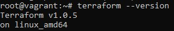
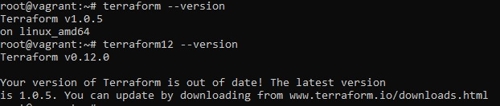

## Домашнее задание к занятию "7.1. Инфраструктура как код"

1. 
- Будет неизменяемый тип инфраструктуры, т.к. будет использоваться Terraform, Docker
- Центрального сервера не будет, Terraform он не нужен
- Агентов не будет, ни для одиного инструмента он не используется
- Будет Terraform как средство инициализации, Ansible как средство конфигурации

Инструменты:
- Terraform
- Docker
- Kubernetes 
- bash скрипты для упрощения рутинных задач
- Teamcity для автоматизации процессов
- возможно понадобится Ansible

2. 
		<!---->

3. 
		<!---->