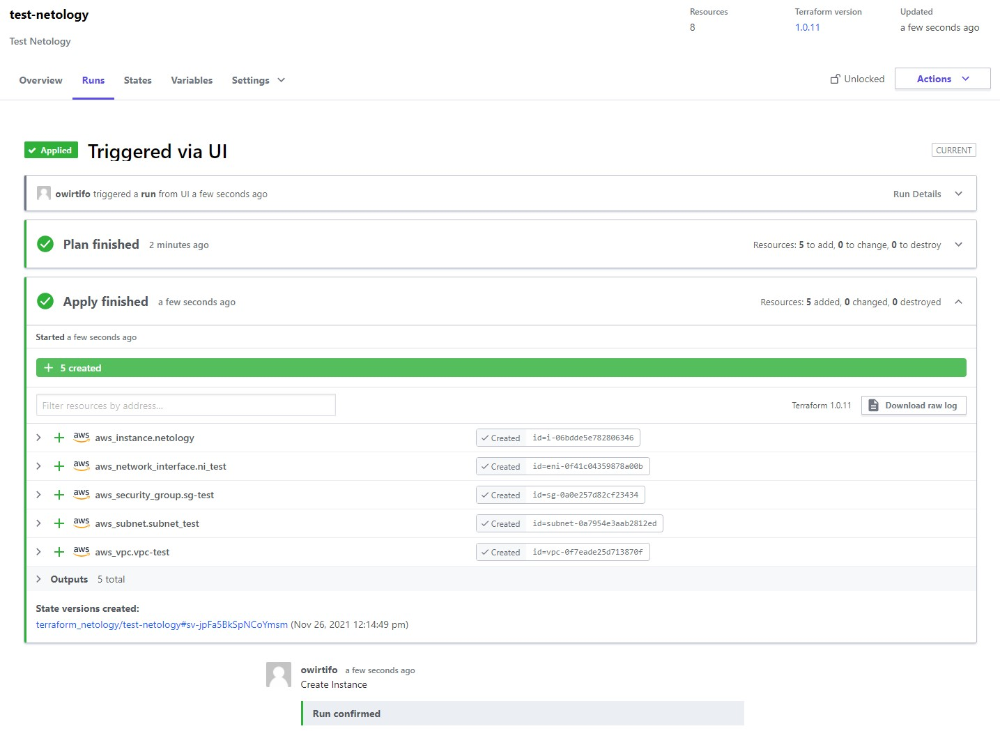

## Домашнее задание к занятию "7.4. Средства командной работы над инфраструктурой."

1. Успешное применение конфигурации:

		<!---->

2. Файлы server.yaml и atlantis.yaml лежат в корне репозитория с ДЗ
3. Я бы использовал непосредственно ресурс aws_instance без помощи модуля, т.к. модуль от aws для создания ec2 инстансов определяет только один нужный для меня ресурс и будет иметь лишнюю прослойку, а ресурсы переодически обновляются, поэтому придется ждать когда обновиться модуль. Плюс нужно потратить время, чтобы его изучить, поэтому модуль несильно упрощает конфигурацию и проще сразу создать инстанс.  
Ссылка на конфигруацию с использованием модуля ec2-instance:  
**https://github.com/Owirtifo/terraform**
